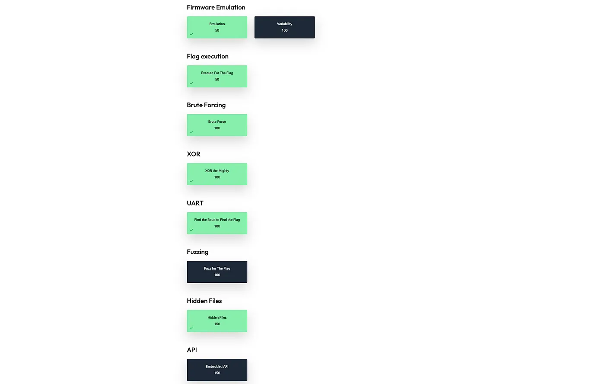
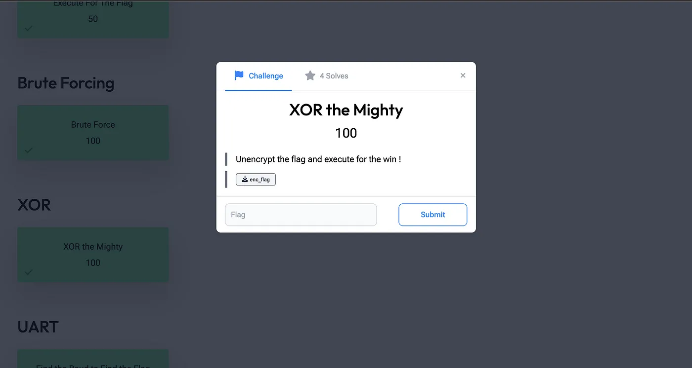
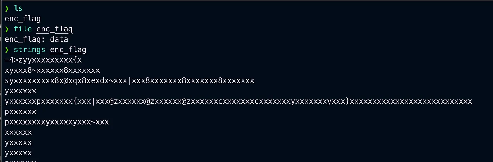
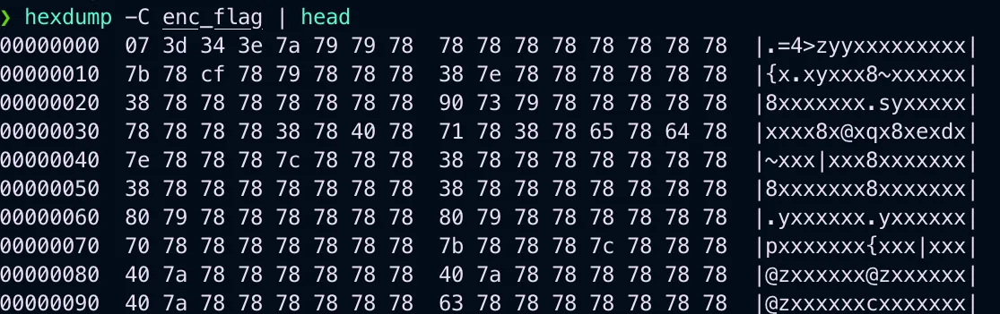
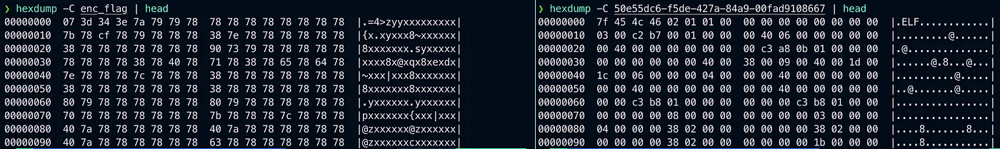

# EXPLOIT SECURITY For IOT and Embedded-based CTF Platform

EXPLOIT SECURITY For IOT and Embedded-based CTF Platform


{ .glightbox .center width="500" }


[Exploit Security | Penetration Testing | Security ConsultancyExploit Security | Penetration Testing Services | Security Researcherswww.exploitsecurity.io](https://www.exploitsecurity.io/)

[](https://www.exploitsecurity.io/)

[Emulate to ExploitateEdit descriptionexploitthis.ctfd.io](https://exploitthis.ctfd.io/)

[](https://exploitthis.ctfd.io/)

Recently on LinkedIn, I got a DM from Victor Hanna He is also the founder of Exploit Security and CHO, also in Exploit Security offers penetration testing services for Web Application Assessment, Infrastructure Assessment, Wireless Assessment, Embedded Systems Assessment and Mobile Assessment which you check at

#### exploitsecurity.io

he has created CTFs mainly for embedded and IoT security which you can check out at. he was found in creating these labs which are amazing and give great knowledge about embedded and IoT security scenarios

#### exploitthis.ctfd.io

Moreover, these CTFs are a great opportunity to learn and practice your embedded and IoT hacking skills/pen-testing skills.

As im also learning embedded security and IOT security this was a great opportunity to get to know and work around these types of lab or CTFs because you might not see many of these CTFs out there and that's where this makes this platform exclusive and rare for a enthusiast who want to get into embedded and IOT security

Let's check out some labs

{ .glightbox .center width="500" }

Till date, they have uploaded around 8+ labs and continue to upload more and all of them have their categories from Firmware Emulation, XOR, UART, API etc.

let's Do a lab and let me give a small walkthrough i will be doing XOR

### XOR

Start by downloading the required file

{ .glightbox .center width="500" }

*enc_flag*

checking what type of file we have also using strings to check its content


{ .glightbox .center width="500" }

It's a data type file

Data file formats usually come in two main varieties: Binary files — files that contain information in their binary format, and Text-based files — containing text-based data and information, for documents that are primarily databases. -source google

Now that we know what type of file we are dealing with, we can now use a utility such as HEXDUMP to help us ascertain the files nuances.

```bash linenums="1"
hexdump -C enc_flag
```

C: Denotes canonical format i.e. hex+ASCII

{ .glightbox .center width="500" }
We notice the hex contains a repeating value i.e. ‘x’ or ‘\x78’, this leads us to infer that this may be our ‘magic character’ used to XOR the original flag.

We can safely infer this as hex \x00 within the binary, when XOR’d with the ‘magic character’ will result in the same character ‘magic character’. Below shows the side by side view of both the XOR’d and non-XOR’d file comparison, noting the \x00 bytes.

{ .glightbox .center width="500" }

With this information obtained, we can now look to XOR the enc_flag binary, which should now uncover the plaintext version of the file. There are numerous online utilities that would allow for us to do this, however Exploit Security likes to live of the land, so they suggested utilising python to do this.

```bash
#!/usr/bin/python3withopen("enc_flag","rb")
asf:rd=bytearray(f.read())forn,
vinenmurate(rd):rd[n] = v^ord("x")
withopen(decrypted_flag,"wb")asg:g.write(rd)
```

Now with the deXOR’d file on-hand we can execute it for the win!

```bash
./decrypted_flag |base64-Ddflag{B{spoiler}s}
```

and there we have the flag

You can check out the labs and I also hope you try these CTF

discord link

[Join the exploitsecurity.io Discord Server!Check out the exploitsecurity.io community on Discord - hang out with 12 other members and enjoy free voice and text…discord.gg](https://discord.gg/bSYGc5nP)

[](https://discord.gg/bSYGc5nP)

Thank you for Reading

