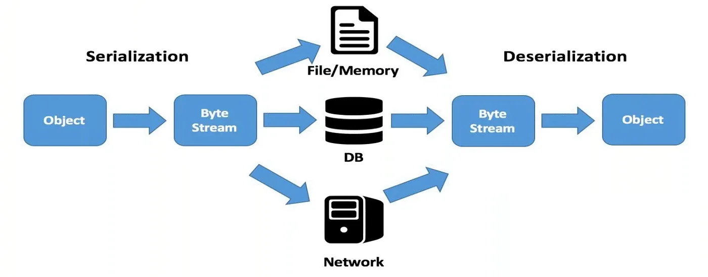
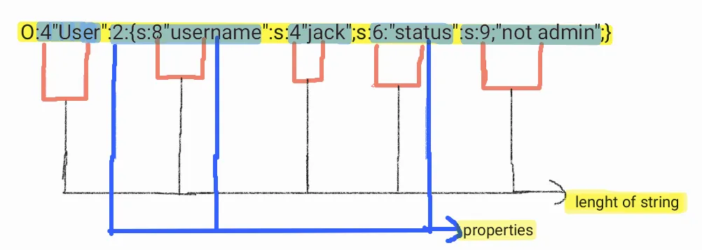
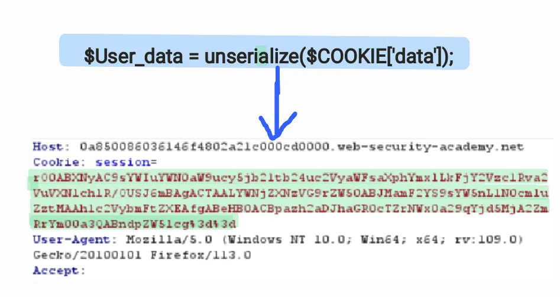

# Introduction to Insecure Deserialization

### Introduction

Insecure deserialization is when user-controllable data is deserialized by a website.

{ .glightbox .center width="500" }

In order to understand the vulnerability we first need to understand how this work and what goes into the back end and how the process of serialization and unserialization works.

Serialization is the process of converting a data object — a combination of code and data represented within a region of data storage — into a series of bytes that saves the state of the object in an easily transmittable form.

The process in which the data gets serialize and becomes easy to store is called serialization let’s see an example of serialized data.


```php linenums="1"
// some PHP code   
$User = new username;  
$User-> Username = 'jack';   
$User-> status = "not admin";
```
#### The below code is the serialized form of the above code


```php linenums="1"
Serialized data  
O:4:"User":2:{s:8":"Username";s:4:jack;s:9:"not admin"}
```
#### Insecure deserialization is commonly found in these languages

* PHP
* Python
* Java
* Ruby

### PHP Serialization and Deserialization Process

Taking the example of php object injection vulnerability which is the same as insecure deserialization.

Now in php, there are two functions that are required to be understood.

1) serialize()

2) unserialize()

Lets look into serialize() function.

```php linenums="1"
<?  
class User{  
 public $username;  
 Public $status;  
 }  
$User = newuser;  
$User-> username="jack";  
$User-> status ='not admin';  
echo serialize($User)   
?> 
```

```php
serialized form  
O:4"User":2:{s:8"username":s:4"jack";s:6:"status":s:9;"not admin";}
```
Let’s understand this serialization form better using a bit of reference

```bash
B: The Boolean   
I: THE\_INTEGER  
d: THE\_FLOAT   
s: LENGHT\_OF\_STRING:AUTUAL\_STRING  
a: NUMBER\_OF\_ELEMENTS:{ELEMNET}  
O: LENGHT\_OF\_NAME:"CLASS\_NAME":NUMBER\_OF\_PROPERTIES:{PROPERTIES}
```

```php
O:4"User”:2:{s:8"username”:s:4"jack”;s:6:”status”:s:9;”not admin”;}
```

{ .glightbox .center width="500" }


```bash
basically, the total number of alphabets in a word is first put as a number after   
writing any reference for example s:6"sticks" s is the length of the string  
   
4 - User | s  
2 - username, status | O  
8 - username | s  
4 - Jack | s  
6 - status | s  
9 - not admin ## including the spacing between the words | s 
```
Now that we understand this, we can change the request where we can change the user status for example.

```bash
s:6:”status”:s:9;{not admin”;} — -> s:6:”status”:s:9;{“admin”;}
```

Here we changed the status code to admin although this is not exactly the vulnerability the AIM is to get an RCE(Remote Code Execution) via insecure deserialization which is what we are aiming to achieve.

For RCE we also need to know functions related to php now these functions may differ from one language to another but for PHP, these functions are called.

* **\_wakeup()**
* **\_destruct()**

**wakeup()** function is used to establish a connection between the user and the server or reestablish the connection with was lost during serialization.


```js  linenums="1" hl_lines="4-7"
Class testdb{  
 private $hook;  
 fucntion\_construct(){  
 #main function that we need to understand   
 ** $User\_data = unserialize($COOKIE['data']); **  
 function\_\_wakeup(){  
if (isset($this->hook)) eval($this->hook):   
}}
```
Here **$User\_data = unserialize($COOKIE[‘data’]);** the function uses the cookie to evaluate the given data or value here which is executed which allows the user to fetch information just using the cookie, here in this code the (hook) function is created and which then later executed using eval function [The `eval()` method evaluates or executes an argument.].

The cookie data which is base64 encoded gets unserialized and gets executed given an example below.

{ .glightbox .center width="500" }

Therefore we need to manipulate the cookie in order to achieve RCE using insecure deserialization now that we understand that we need to manipulate the cookie data, lets now see with an example how we will manipulate the cookie.


```php linenums="1"
<?php  
class prodtest1  
{   
 pirvate $hook = "phpinfo();";  
}  
print urlencode(serialze)(new prodtest1);  
?>
```
On running the above code we will get.


```php linenums="1"
O%3A9%3A%22Prodtest1%22%3A1%3A%7Bs%3A15%3A%22%00Prodtest1%00hook%22%3Bs%3A10%3A%22phpinfo%28%29%3B%22%3B%7D
```

Enough of the theory let’s do some lab
Part 1
Part 2
I will post the lab walkthrough

Thank you for reading


