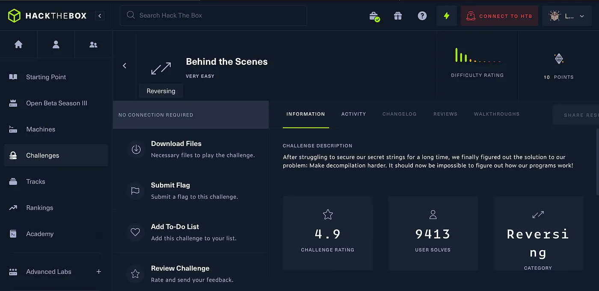
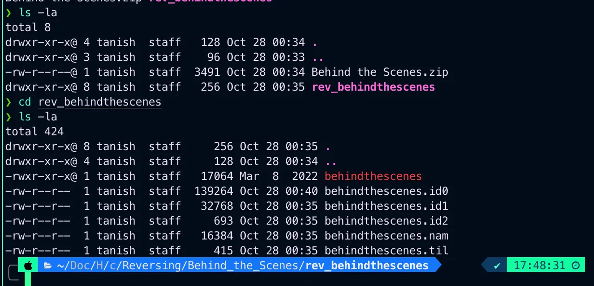
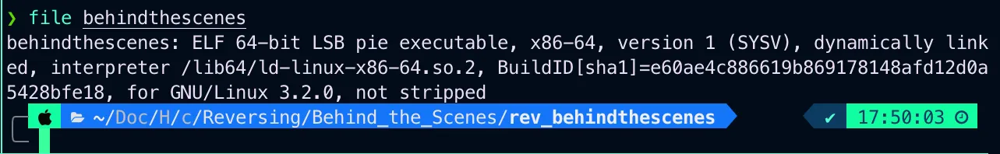
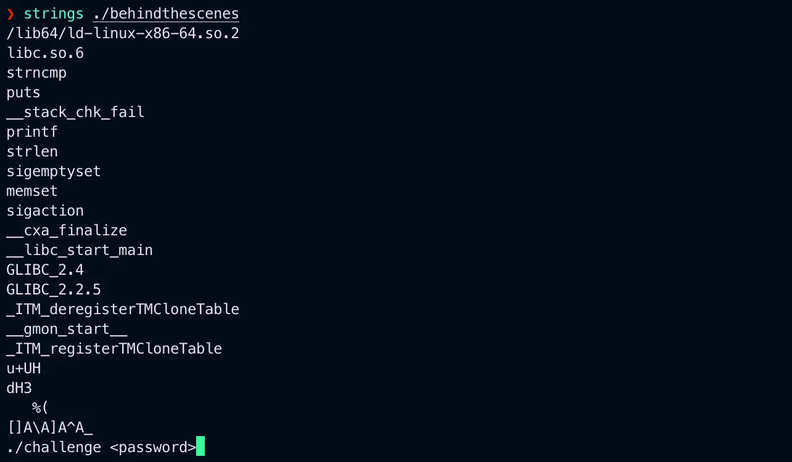
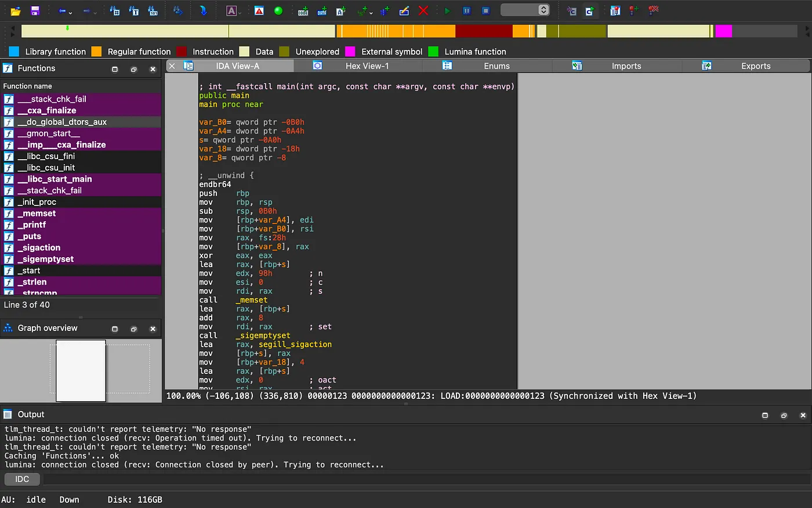
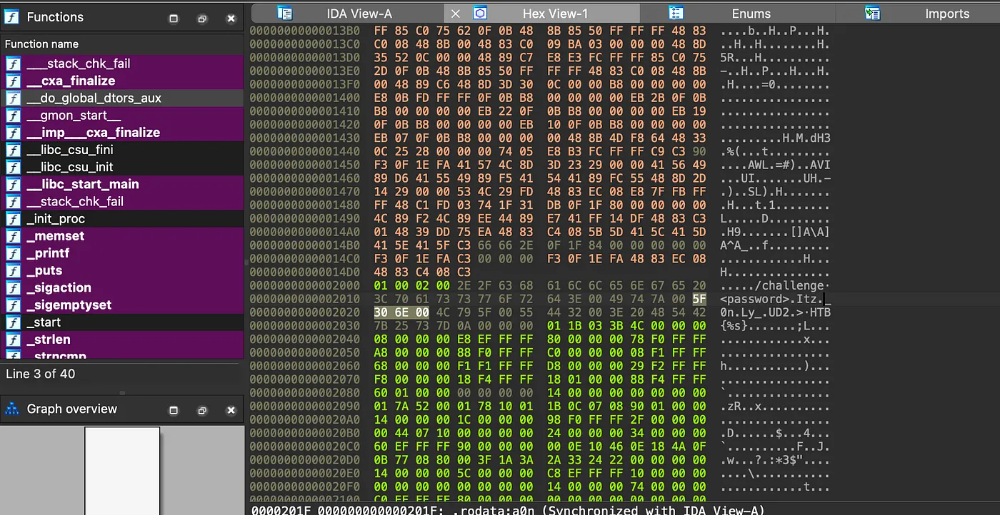

# HackTheBox Behind the Scenes

{ .glightbox .center width="600" }

```
HTB-Challenges:- Reversing 
Challenge Info:- Reverse Engineering
Challenge Level:- Very Easy
```

---
Im continueing to post Reverse engineering content bcoz im trying to dig deep into it and im first trying to get better at basics and these lab are easy but still a part of learning process let’s continue doing the lab.

Downloaded the file and unzipped it.

And there were 6 files.

{ .glightbox .center width="500" }


Checked the behindthe scenes file.

{ .glightbox .center width="500" }

And it found to be a ELF 64-bit file which is baisclly a executable linux file,
I checked it’s content using strings.

{ .glightbox .center width="500" }

Now to analysing this file im using IDA64, Opened and started looking into the file contents.

{ .glightbox .center width="500" }

In hex view-1 i found something it looked werid.

{ .glightbox .center width="500" }

If you can observe it, this is formaing the flag itz._ ……

So i copy it and basiclly the flag is written in a reverse order plus there a bit of tempereing that need’s to be done(remove the fullstops) and you will be clearly able to see the flag.

and done

Thank you for reading.


