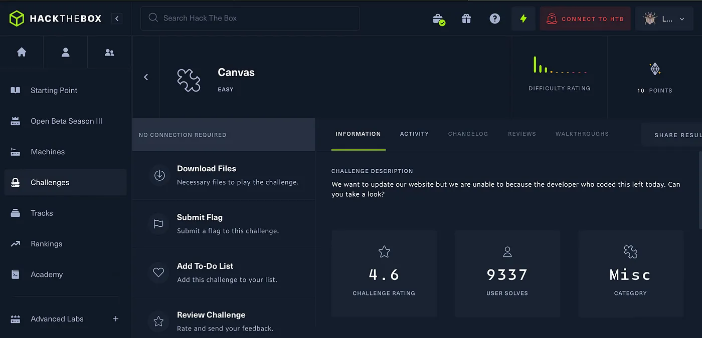
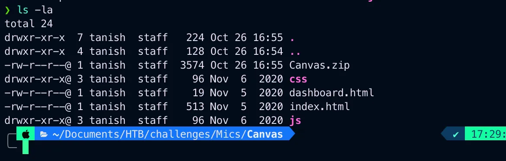
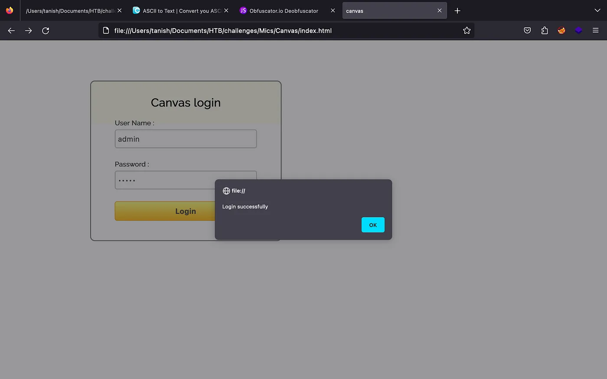
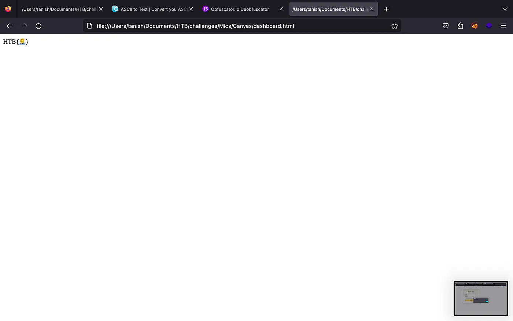
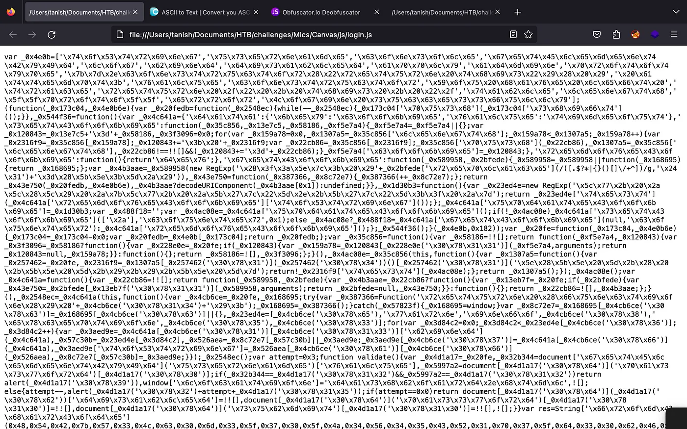
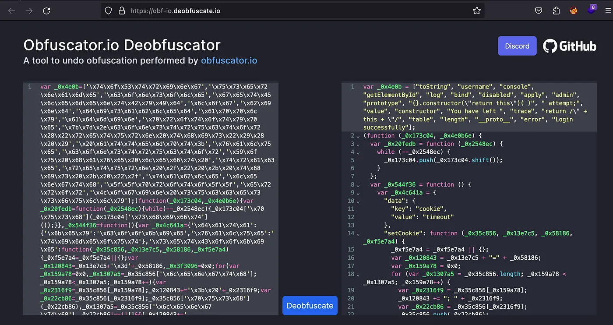
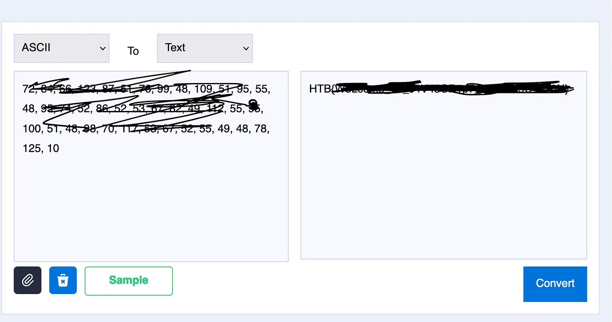

# HackTheBox Canvas

{ .glightbox .center width="600" }

```
HTB-Challenges:- Mics  
Challenge Info:- Mics encryption based  
Challenge level:- Easy
```

---
The lab is simple and doesn't require much efforts but i did the lab it is becoz you can earn points so i did the lab.

downloaded the zip file and unzipped.

there were 4 files.


{ .glightbox .center width="500" }

I opend index.html but found nothing.

Just a simple login page when i enter admin:admin it gave a mock flag.

{ .glightbox .center width="500" }

{ .glightbox .center width="500" }

I looked around and in /js found login.js and opend it.

{ .glightbox .center width="500" }

So if you didn’t get it yet we need to Obfuscate js.


{ .glightbox .center width="500" }

Now analyzing javascript code we understond how the code work  
also found it stores the result in ASCII.

now we just need to decode ASCII code to get to the flag.


{ .glightbox .center width="500" }

Thank you for reading
