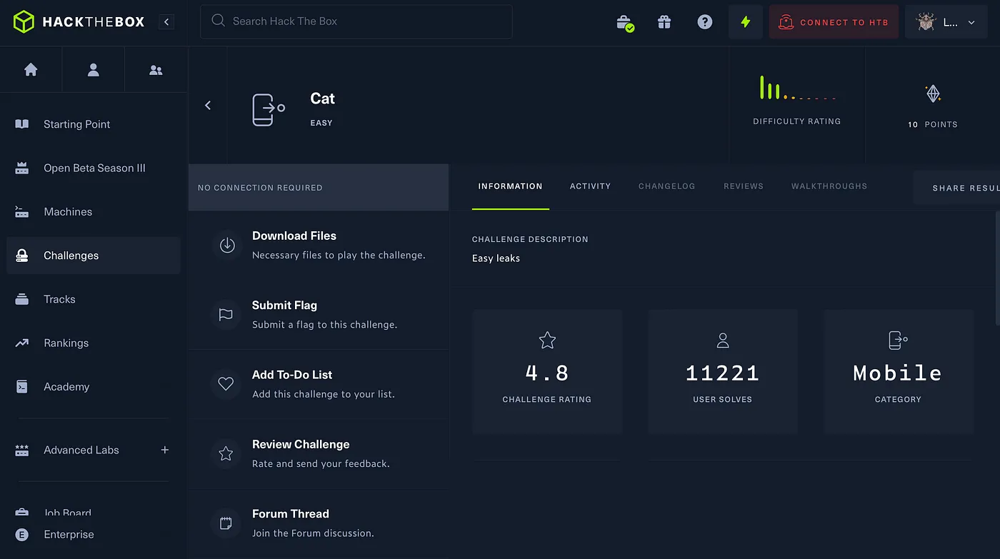
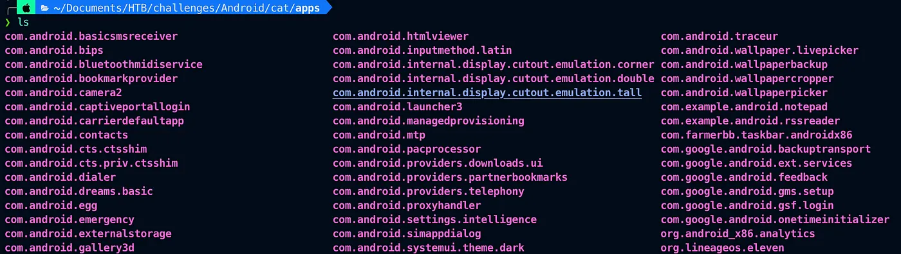
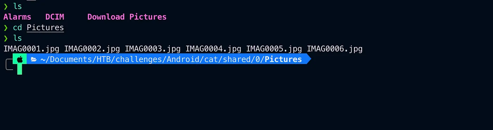
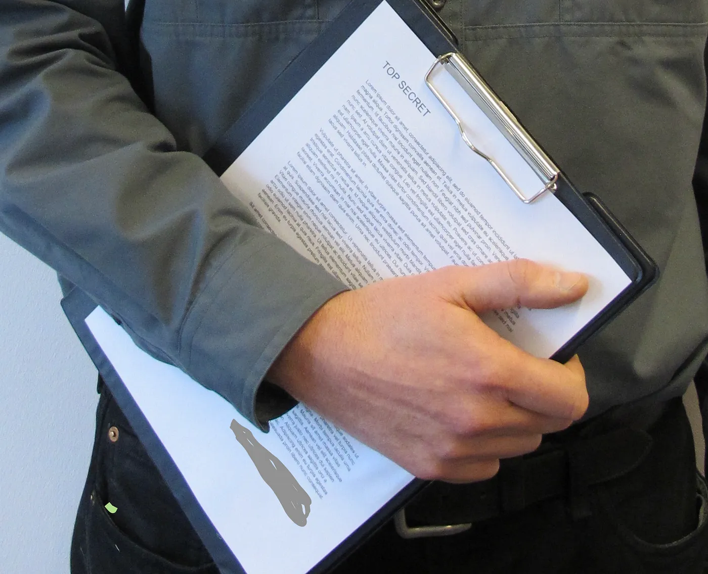

# HackTheBox Cat

{ .glightbox .center width="600" }

```
HTB-Challenges:- Mobile
Challenge Info:- Mobile based 
challenge Challenge level:- easy
```

---
I started by downloading the necessary files Cat.zip file unzipped it and found a cat .ab file now .ab files are Android Backup files use the following command to extract the content of the .ab file

```bash
( printf "\x1f\x8b\x08\x00\x00\x00\x00\x00" ; tail -c +25 cat.ab )
```

And found the following files inside.

{ .glightbox .center width="500" }

So I opened and searched through the apps folder and did not find anything in it.

{ .glightbox .center width="500" }

Then moved to another folder (shared) and there are 4 folders 3 of them were empty and one folder named Pictures Containers 6 Photos.

{ .glightbox .center width="500" }

I opened each image but clearly, IMAG0004.jpg looked suspicious so I opened it.


{ .glightbox .center width="500" }

Bottom of the top secret page.

Thank you for reading

