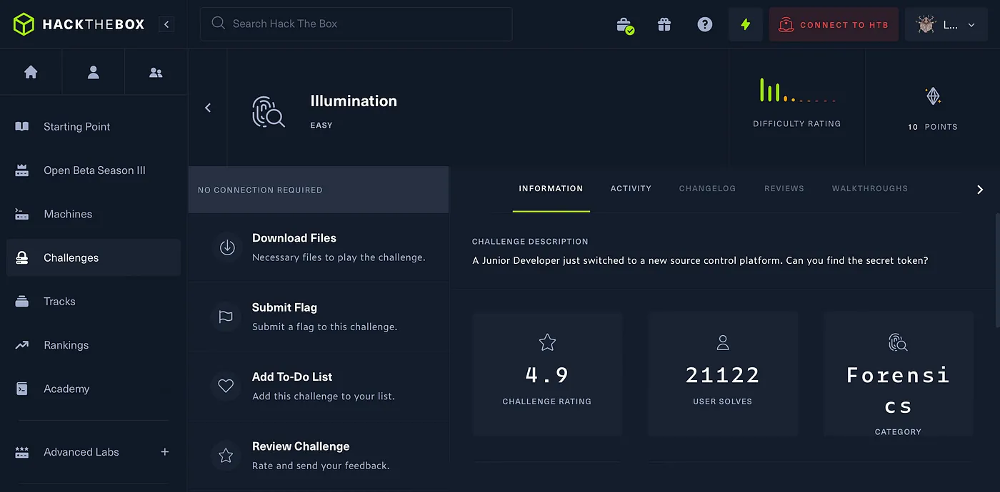
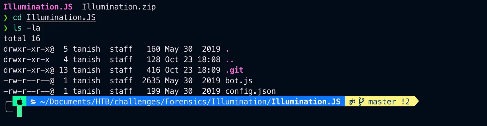
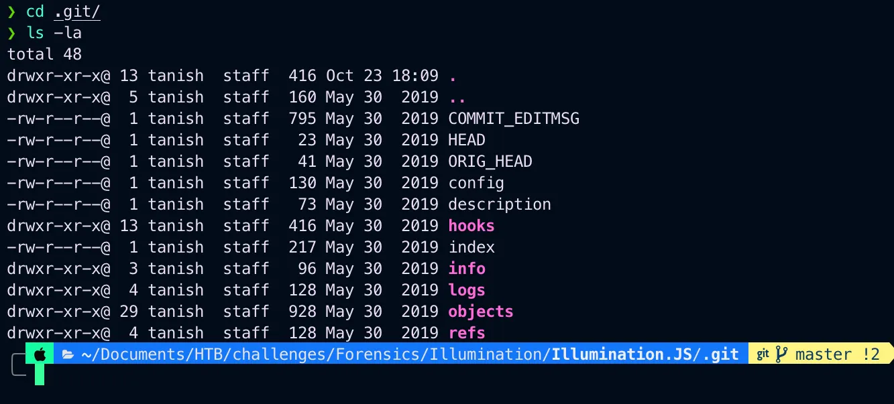
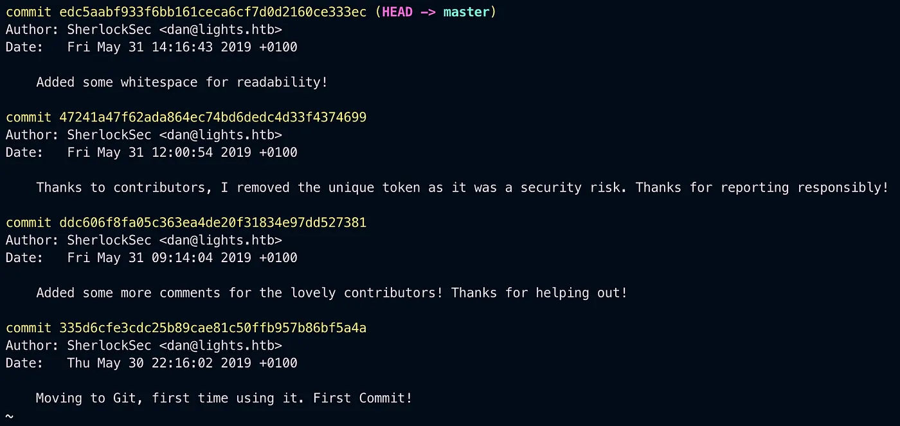
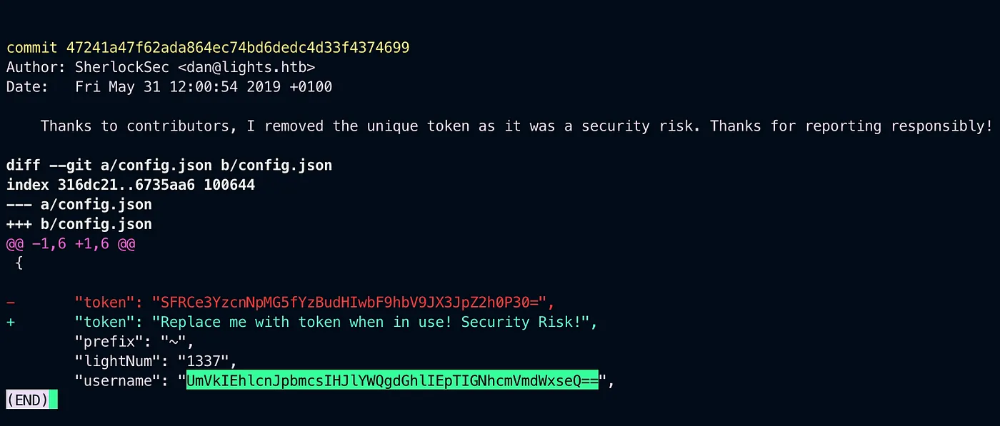
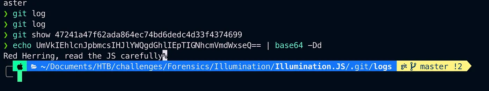
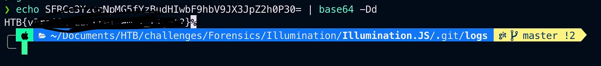

# HackTheBox Illumination

{ .glightbox .center width="600" }

```
HTB-Challenges:- Forensics  
Challenge Info:- Forensics (Git)  
Challenge level:- Easy
```

Downloaded the file and unzipped it.

{ .glightbox .center width="500" }

And there were 3 files .git, bot.js and config.json I looked into the .git file and found a few more files.

{ .glightbox .center width="500" }

Looked into the logs files and used git command to look into the logs.

```bash
git logs
```
{ .glightbox .center width="500" }


See carefully that author has removed a unique token lets look into this.

```bash
git show 47241a47f62ada864ec74bd6dedc4d33f4374699
```
{ .glightbox .center width="500" }


Now there is a token and a username both looks like a base64 encoding so   
lets decode them first lets try with the username.

{ .glightbox .center width="500" }


And nothing now again i tried with token

{ .glightbox .center width="500" }

And got the flag

Thank you for reading
