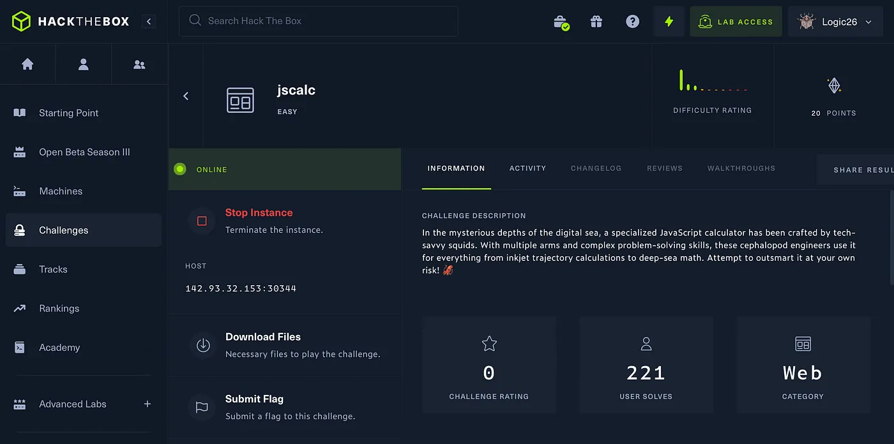
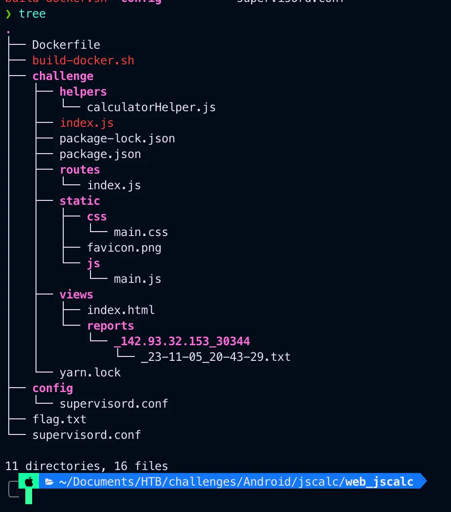
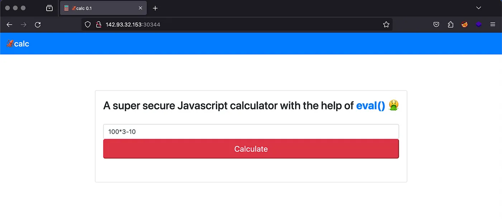
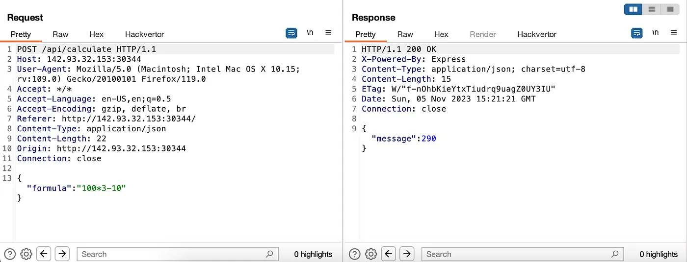
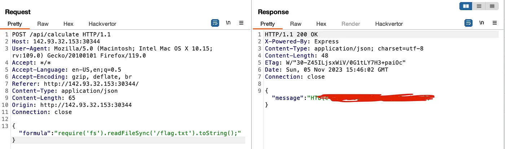

# HackTheBox Jscalc


{ .glightbox .center width="600" }

```
HTB-Challenges- Web
Challenge Info:- Web based challenge 
Challenge level:- Easy
```

---

CHALLENGE DESCRIPTION

```
In the mysterious depths of the digital sea, a specialized JavaScript 
calculator has been crafted by tech-savvy squids. With multiple arms 
and complex problem-solving skills, these cephalopod engineers use it 
for everything from inkjet trajectory calculations to deep-sea math. 
Attempt to outsmart it at your own risk! 🦑
```

Downloaded the file and unziped them.

{ .glightbox .center width="500" }
On visiting on the given ip and port this web page opened.

{ .glightbox .center width="500" }
I opened burp and captured the request.

{ .glightbox .center width="500" }
So it uses some {“formula”:” ”} and send the value for final sum we can use.

```bash
{"formula":"require('fs').readFileSync('/flag.txt').toString();"}
```

now lets try caputering the request again and send it to repeater.

and we got the flag.

{ .glightbox .center width="500" }
Thank you for reading.

