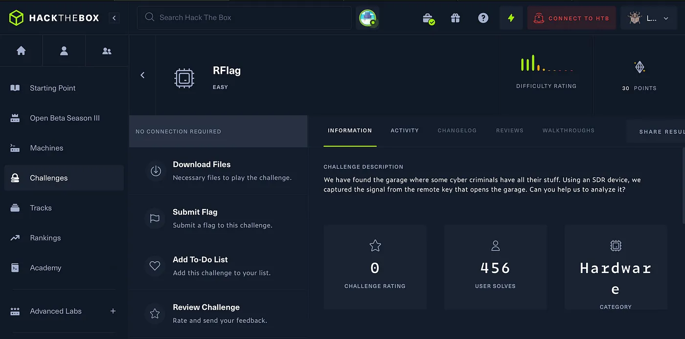
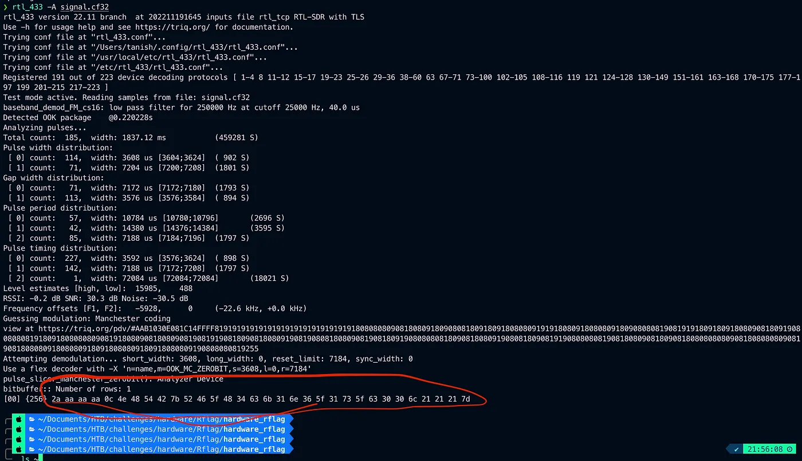

# HackTheBox RFlag

{ .glightbox .center width="600" }
```
HTB-Challenges:- Hardware
Challenge Info:- Decoding cf32 
Challenge level:- Easy
```

---
Download the file and checked its extension cf32 i dont know what it is so i searched about it and found that it is some form of radio fequency single also found that a perticular tool called rtl_433 is used to decode such signal.

[GitHub - merbanan/rtl_433: Program to decode radio transmissions from devices on the ISM bands (and…Program to decode radio transmissions from devices on the ISM bands (and other frequencies) - GitHub …github.com](https://github.com/merbanan/rtl_433)

[](https://github.com/merbanan/rtl_433)

Install the following tool if you want you can directly install it by using.

If using Debian.

```
apt install rtl_433
```

If using macos.

```
brew install rtl_433
```

Now after installing using the tool.

```
rtl_433 -A signal.cf32
```

Now carefully see this this seems like hex.


{ .glightbox .center width="500" }
Im using cyberchef to decode this and i got the flag.

Thank you for reading


