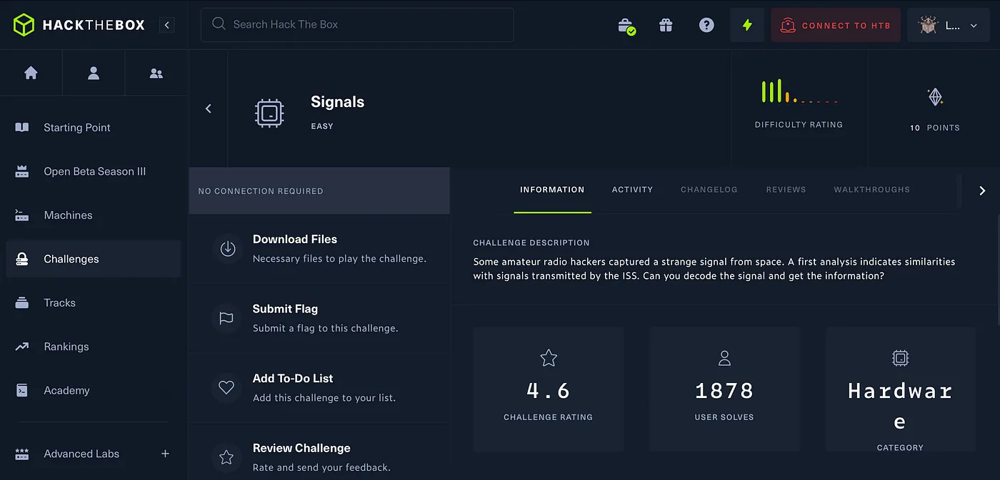
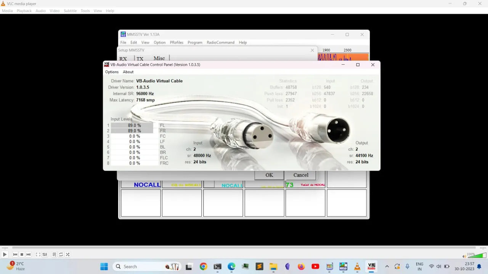
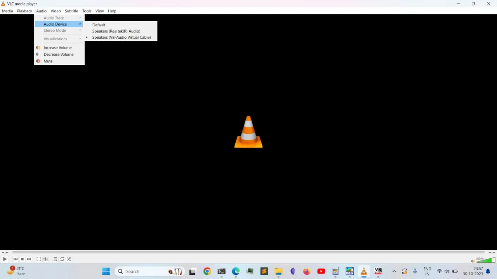
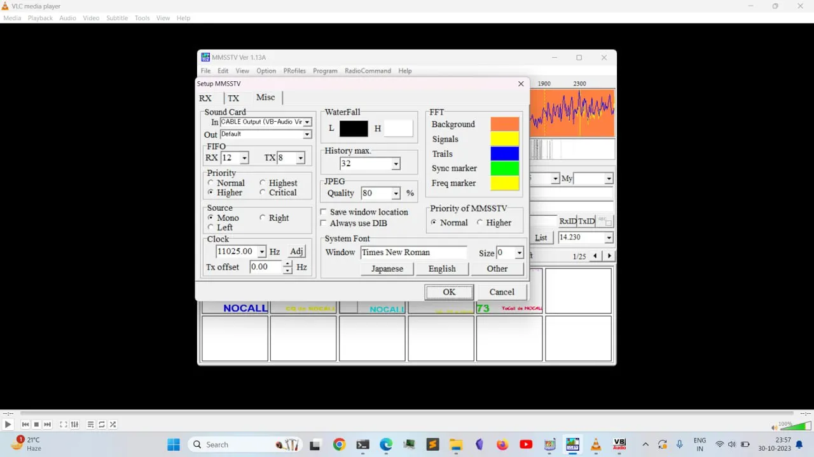
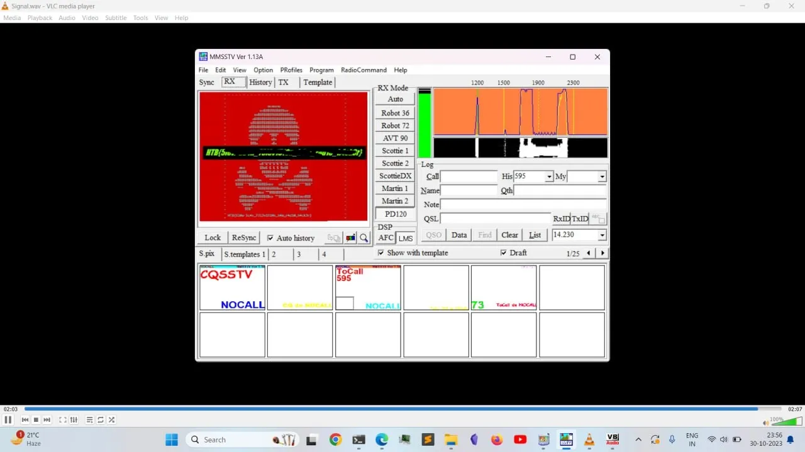

# HackTheBox Signals

{ .glightbox .center width="600" }
```
HTB-Challenges:- Hardware
Challenge Info:- Decoding Wav signals
Challenge level:- Easy
```

---
So starting the challenge it was obivus when i saw a .wav file that its an audio file so there must be something related to analysing the graph or spectrogram but none the less i started the challenge and got to know that it is a sstv file so i looked about and found alot to be explored.

We need 3 things.

Now we need to install vb-audio virtual cable.

{ .glightbox .center width="500" }


And configure it in the vlc player.

{ .glightbox .center width="500" }

Like shown in the above picture.

Then configure sstv or mmstv.

{ .glightbox .center width="500" }

And now start the audio from vlc and wait untill it reveals the flag.

{ .glightbox .center width="500" }

Thank you for reading


