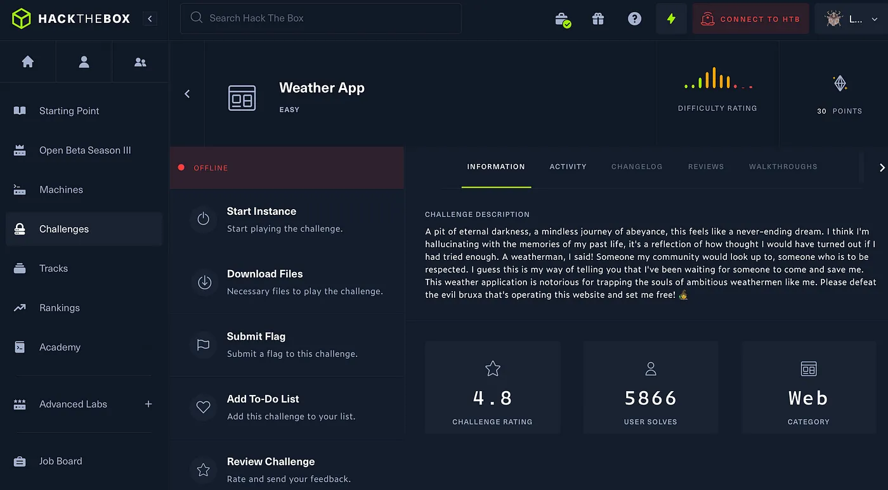
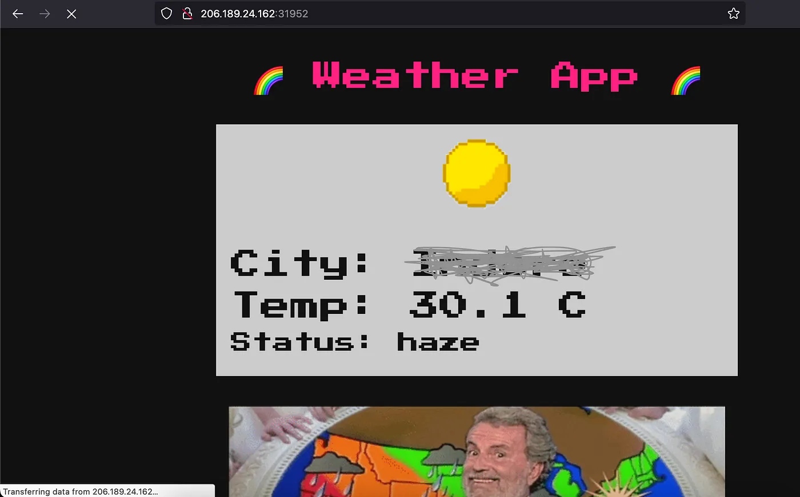
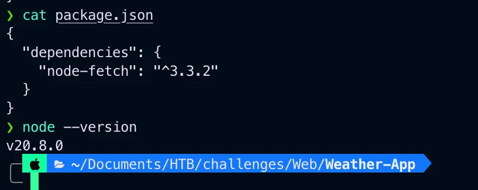
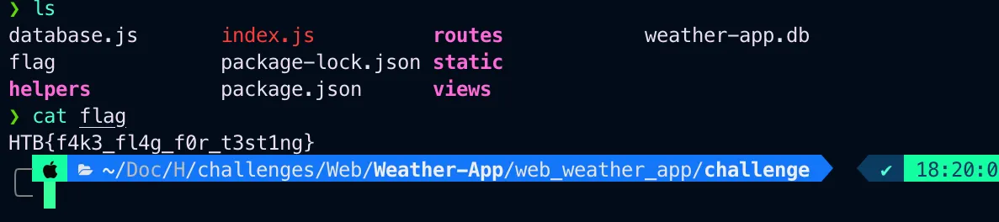
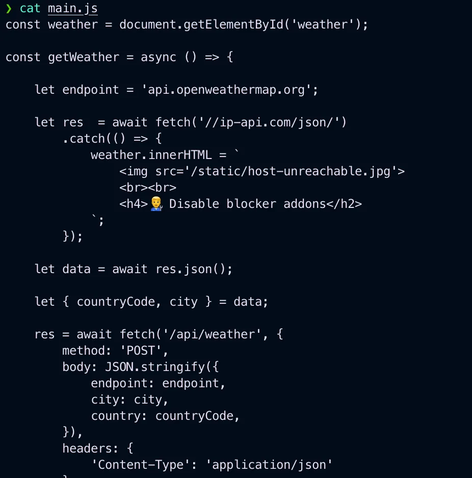
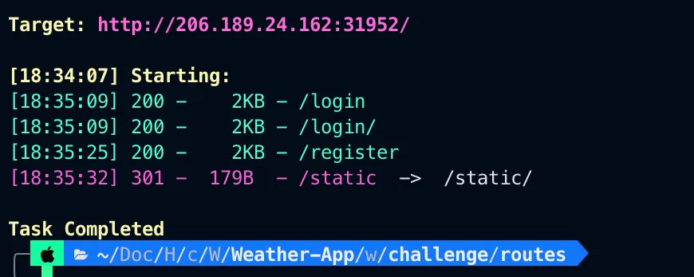
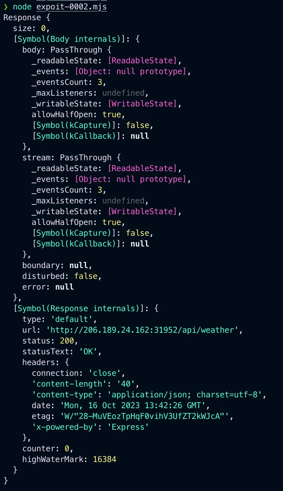
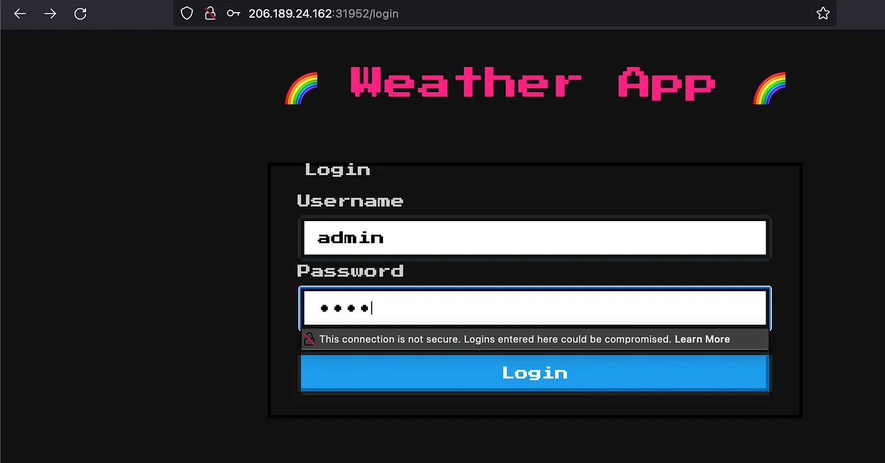
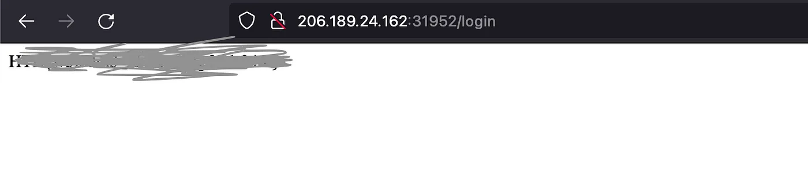

# HackTheBox Weather App

{ .glightbox .center width="600" }
```
HTB-Challenges:- Web
Challenge Info:- Web-Application-based 
Challenge level:- Easy
```

---
Firstly I downloaded the Necessary files to play the challenge. and started the machine.

{ .glightbox .center width="500" }

Now I started looking manually into files I downloaded and on inspection in file a file package.js, that the node-js version was old and I compared it with the latest version which can be seen clearly,

{ .glightbox .center width="500" }

Also there was a fake flag for testing

{ .glightbox .center width="500" }

On analysing the index.js file in /web\_weather\_app/challenge/routes   
found out that if you login as admin you will receive a flag otherwise,  
it will say “you are not admin”

```js
const path = require('path');  
const fs = require('fs');  
const express = require('express');  
const router = express.Router();  
const WeatherHelper = require('../helpers/WeatherHelper');  
let db;  
const response = data => ({ message: data });  

```
Also found API call /api/weather that fetches the weather info this is interesting we can try using different javascript event handlers here and try to fetch the flag or we can try something else.

{ .glightbox .center width="500" }

I also did directory brute force just in case If i missed something.

{ .glightbox .center width="500" }

We found /login and /register which were obvious to be found as we already looked in the login function index.js.

Now I searched about and found a node js code which will basically reset the admin and password.

Note that you will need to change the IP and port number and the city and country.

```js
import fetch from 'node-fetch';  
async function makeRequest() {  
```

Also if you have not installed you need to install node-js in your system   
so if you are using linux you can simply use.

```bash
sudo apt install node
```

In my case, I’m using macOS so mac users use.

```bash
sudo brew install node
```
{ .glightbox .center width="500" }

Now open /login page and enter the credentials for the admin which is reset to admin:test


{ .glightbox .center width="500" }
And we get the flag

{ .glightbox .center width="500" }

Thank you for reading
