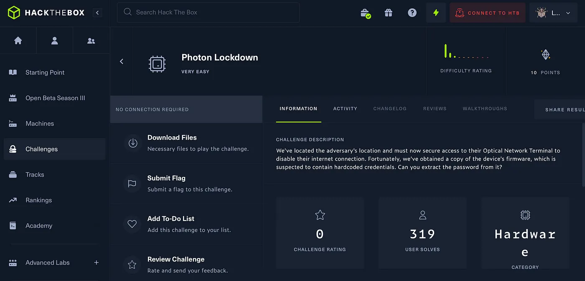
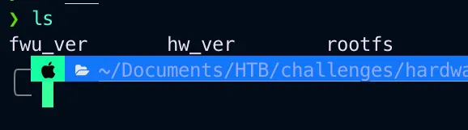
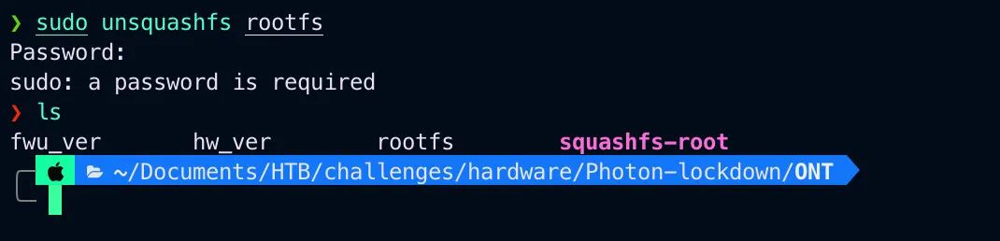
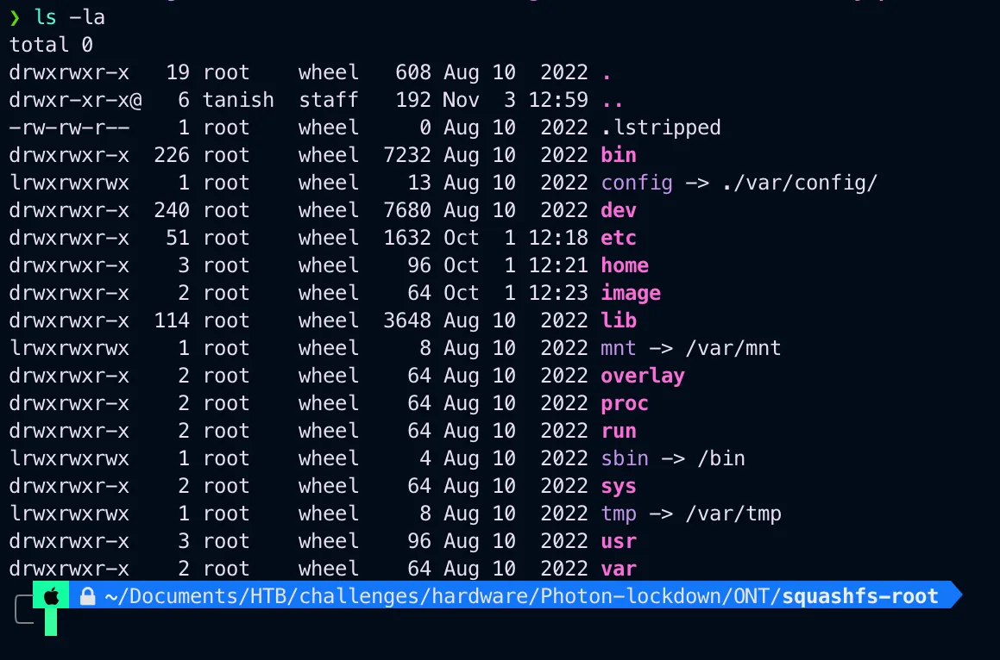
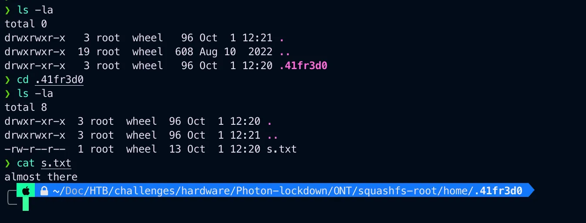
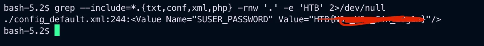
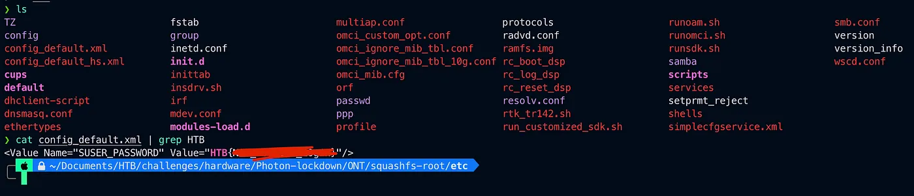

# HackTheBox Photon Lockdown

{ .glightbox .center width="700" }


```
HTB-Challenges:- Hardware
Challenge Info:- Device Firmware
Challenge level:- Very Easy
```

---

*CHALLENGE DESCRIPTION:-*
```
We’ve located the adversary’s location and must now secure access to their 
Optical Network Terminal to disable their internet connection. Fortunately,
we’ve obtained a copy of the device’s firmware, which is suspected to 
contain hardcoded credentials. Can you extract the password from it?
```

As you uzip the file you will see 3 more files.

{ .glightbox .center width="500" }


Now fwu_ver contains some version details of the frimware i guess.

```
3.0.5
```

And hw_ver contains some data i didnt undstood its most probably the firmware name X1.

And the rootfs is a squash file.

Squashfs is a compressed read-only file system for Linux. Squashfs compresses files, inodes and directories.

So we can use squashfs utility here to be specific unsquashfs which will extract all the content of rootfs file.

```bash
sudo unsquashfs rootfs
```

{ .glightbox .center width="500" }


Now we can explore squashfs-root folder.

{ .glightbox .center width="500" }


Now i looked around abit and in the /home directory.

{ .glightbox .center width="500" }


So i know all config file are in /etc folder so i looked in the /etc and stared looking into files for HTB flag

I looked mannually but there is also another way uisng.

```bash
grep --include=*.{txt,conf,xml,php} -rnw '.' -e 'HTB' 2>/dev/null
```

Now this perticular command what this will do is check all file if there is any text, config, xml and php files containg the word HTB if there is any that will print it.

And in the config_default.xml finally found the flag.


Using the command.

{ .glightbox .center width="500" }

---

{ .glightbox .center width="500" }

And got the flag.

---
Thank you for Reading

I have just owned challenge Photon Lockdown from Hack The Box
