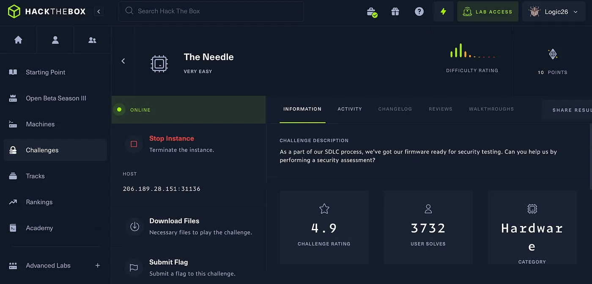
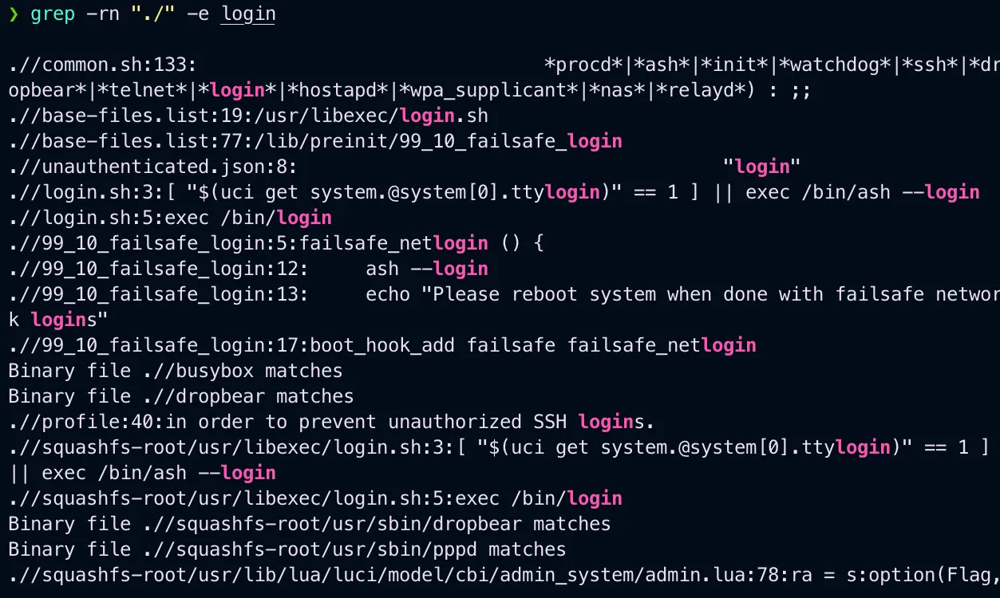
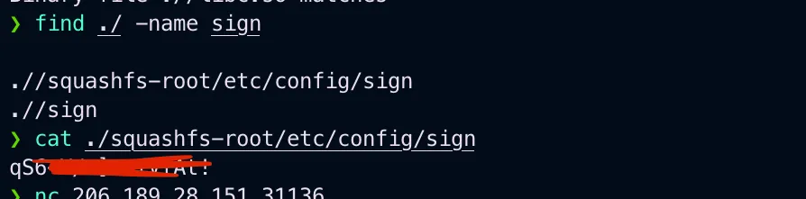
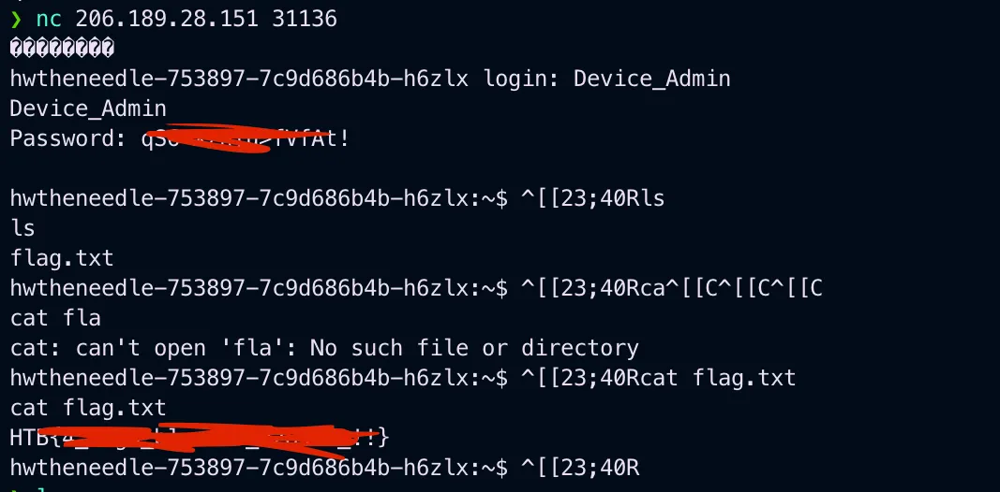

# HackTheBox The Needle


{ .glightbox .center width="600" }

```
HTB-Challenges:- Hardware
Challenge Info:- Firmware analysis
Challenge level:- Very Easy
```
                     
---
CHALLENGE DESCRIPTION
```
As a part of our SDLC process, we’ve got our firmware 
ready for security testing. Can you help us by
performing a security assessment?
```
As soon as you download the requirement file after unzipping it you will see a firmware.bin file now to extract a .bin file we will use binwalk

```bash
╰─ binwalk -e firmware.bin
```

After it is extracted the move into the extracted folder now we need to find any file that contains login info to login

```bash
grep -rn "./" -e login
```

Using this command found.

{ .glightbox .center width="500" }

Got the username now moving to find the password and it is related to something related to sign so lets try find it using the following command.

And found the password.

{ .glightbox .center width="500" }


Now logging in using nc and the username and password we have:


{ .glightbox .center width="500" }

And we also got the flag.

Thank you for reading.

[I have just owned challenge The Needle from Hack The Box](https://www.hackthebox.com/achievement/challenge/753897/220)

