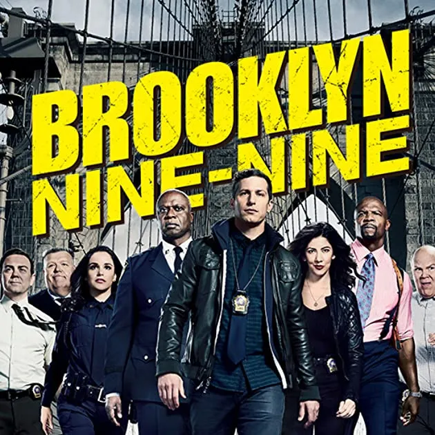
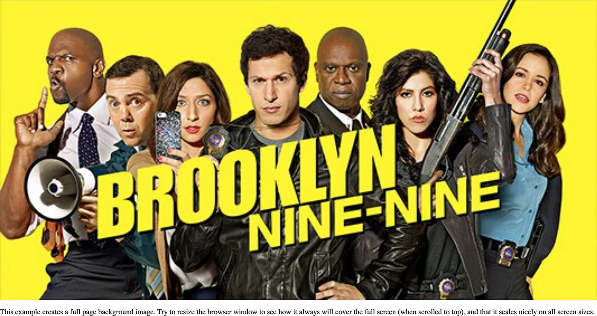
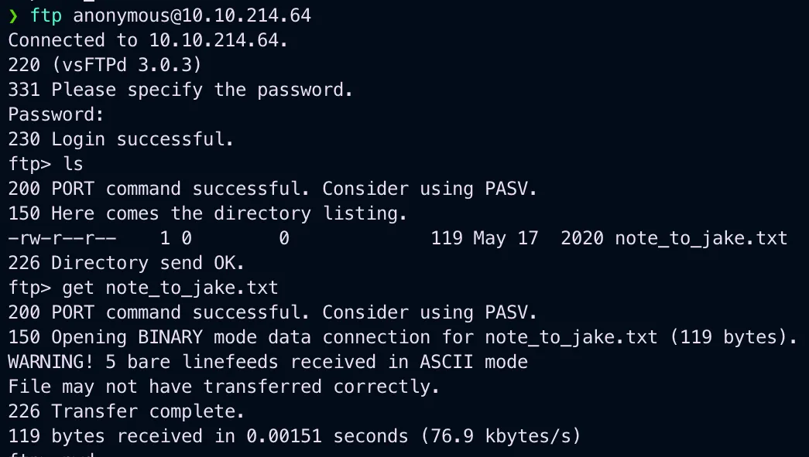
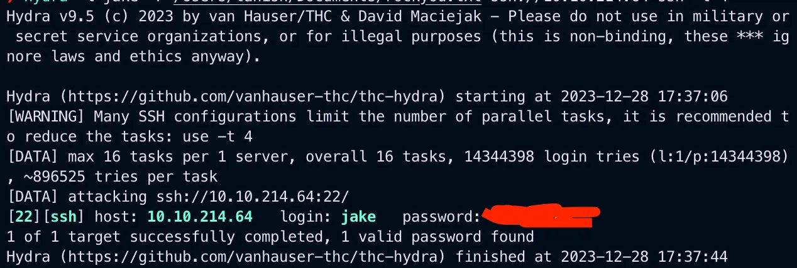
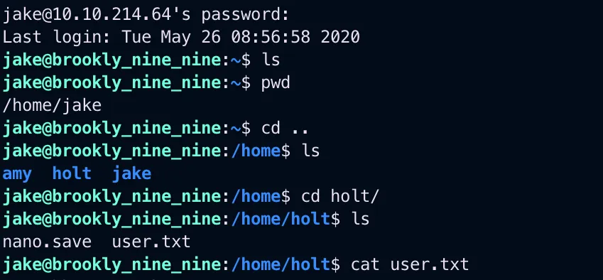
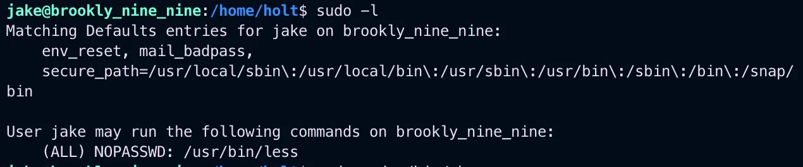
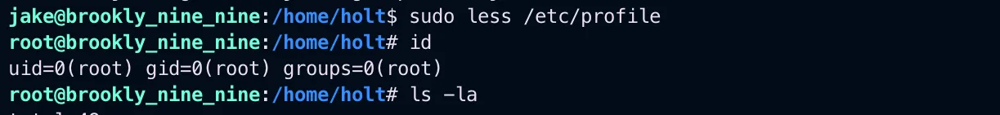
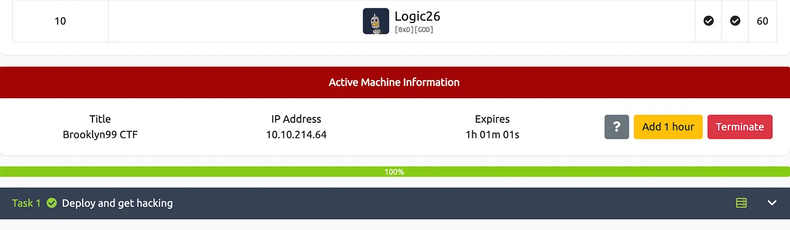

# TryHackMe Brooklyn Nine-Nine


{ .glightbox .center width="500" }
```
TryhackMe Machine:- Brooklyn Nine Nine
Machine Info:- pwn
Machine Level:- Easy
```

---
### Reconnaissance

On visiting the given IP you will see a simple page with an image.

{ .glightbox .center width="500" }

On checking the page source, I didn't find anything.

I did an Nmap scan.


```bash
 nmap 10.10.214.64Starting Nmap 7.94 ( https://nmap.org ) at 2023-12-28 17:54 ISTNmap scan report for 10.10.214.64Host is up (0.14s latency).Not shown: 997 closed tcp ports (conn-refused)PORT   STATE SERVICE21/tcp open  ftp22/tcp open  ssh80/tcp open  httpNmap done: 1 IP address (1 host up) scanned in 35.68 seconds
```

And port 21 ftp was open and I tried anonymous login on it and got in and found a txt file and pulled it out.

{ .glightbox .center width="500" }

And found a message from Amy to Jake telling him that his password is weak now let's try fuzzing the password of jake using hydra.

```bash
hydra hydra -l jake -P rockyou.txt ssh://10.10.214.64 ssh -t 4
```

{ .glightbox .center width="500" }

And successfully logged in as jake also got the user flag inside holt.

{ .glightbox .center width="500" }

Privilege Escalation

Used the simplest thing a CTF mostly have, the easy level ones have is to check using Sudo -l and as expected you will see.

{ .glightbox .center width="500" }

On checking on https://gtfobins.github.io/ found a method.

```bash
sudo less /etc/profile !/bin/bash
```

{ .glightbox .center width="500" }

And we got the root user and the final flag.

{ .glightbox .center width="500" }

Thanks you for Reading