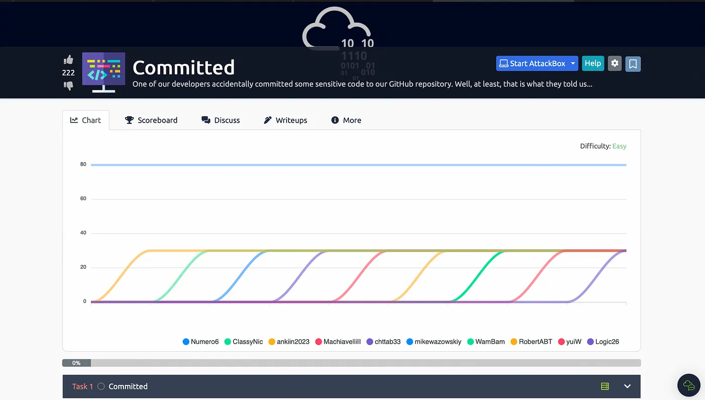
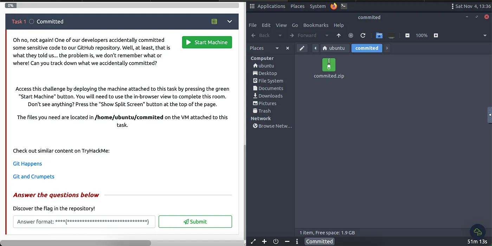
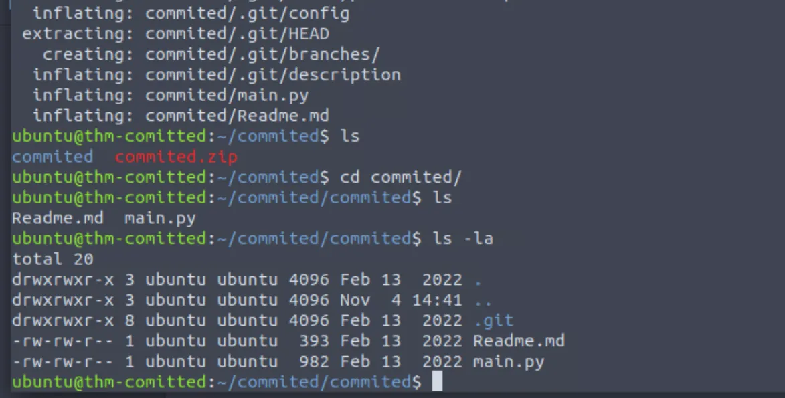
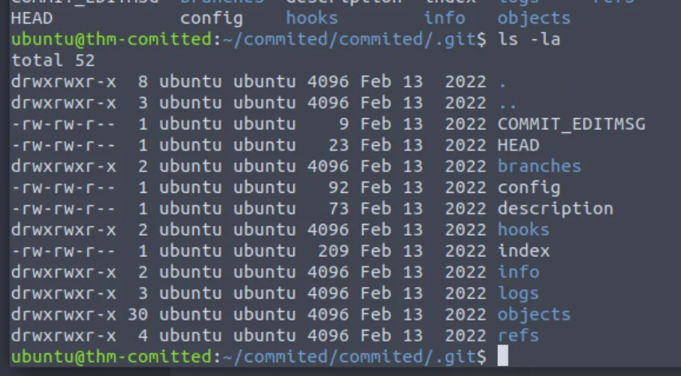
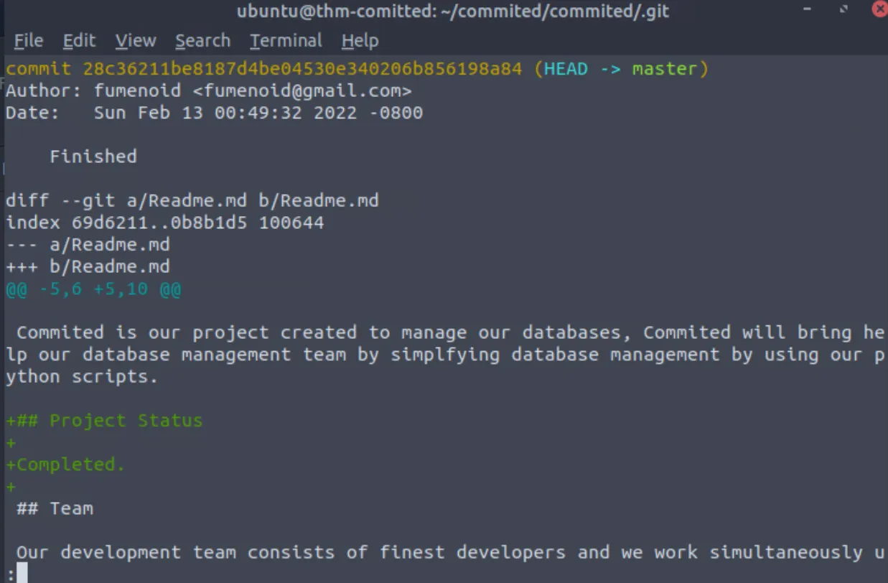
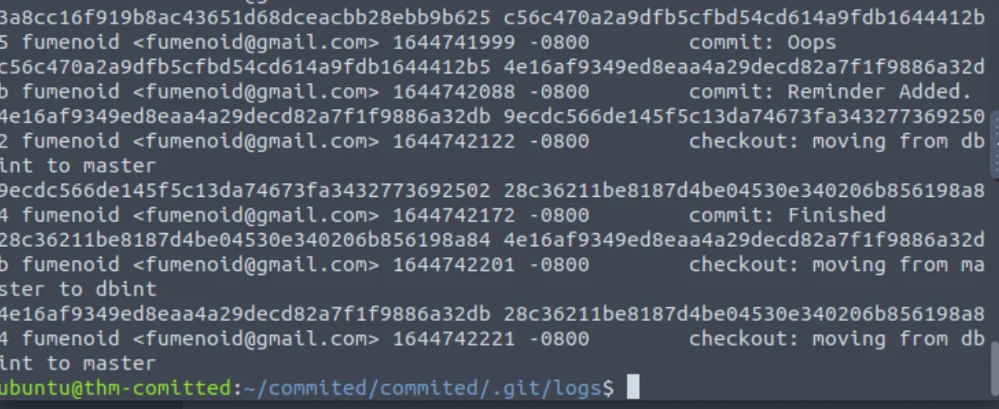
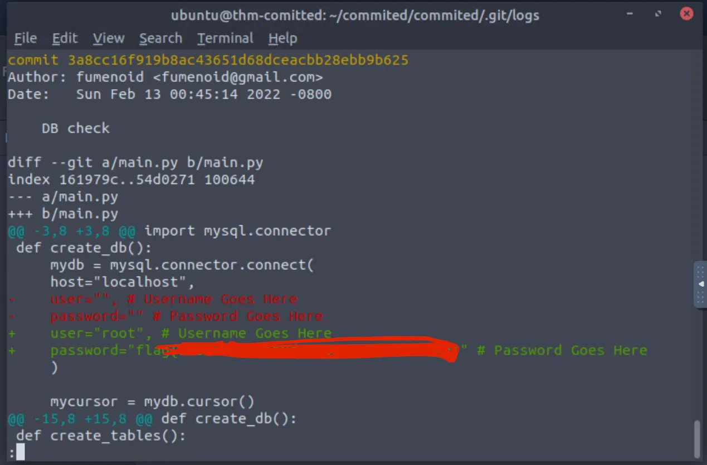

# TryHackMe Committed

{ .glightbox .center width="600" }

```
TryhackMe Machine:- Git Happens
Machine Info:- (Git)
Machine Level:- Easy
```

---

As soon as you start the machine a new window will open up and a web-based VM machine will start.

{ .glightbox .center width="500" }

Now you will be able to see a zip file commited.zip.This file does not have a password to unzip. So you can just use unzip commited.zip to unzip it, and you will be able to see its contents.

{ .glightbox .center width="500" }

There are 2 files and a “.git” folder; there is nothing in the main.py and “readme.md”, i looked in the “.git”.

{ .glightbox .center width="500" }

I have used git show command to check the history of the repo.


{ .glightbox .center width="500" }

In the logs folder, “HEAD” found the commits and found a weird commit called Oops.

{ .glightbox .center width="500" }

So i copied the ID and used it.

git show (followed by the id).

{ .glightbox .center width="500" }

We got the flag.

Although these labs are very easy, they cover the basics of git That's why im doing these labs. I will soon start medium-level labs too.thank you for reading.
