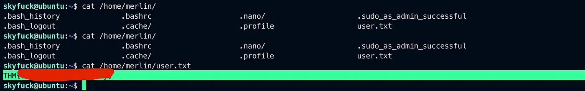
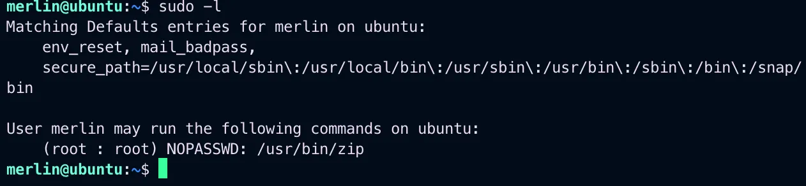
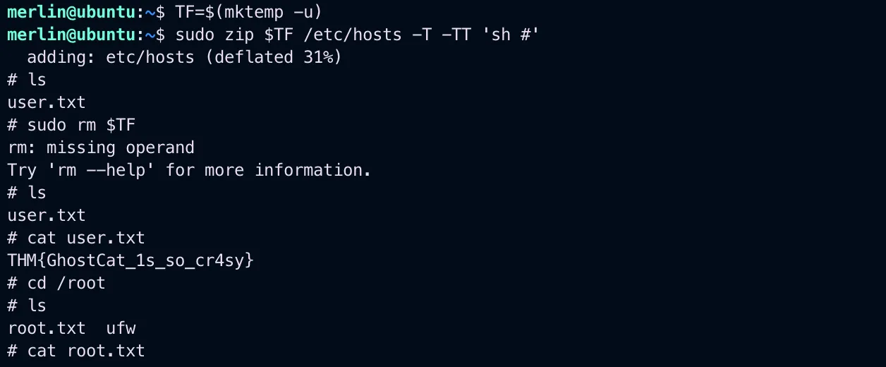

# TryHackMe TomGhost

{ .glightbox .center width="600" }

```
TryhackMe Machine:- Tomghost
Machine Info:- (CVE-2020–1938)
Machine Level:- Easy
```

---

This ctf mainly focuses on use of CVE 2020–1938 let’s start by doing an nmap scan on the IP.

```bash
Starting Nmap 7.94 ( https://nmap.org ) at 2023-10-29 18:26 ISTNmap scan 
report for 10.10.59.201Host is up (0.15s latency).Not shown: 996 closed 
tcp ports (conn-refused)PORT     STATE SERVICE    VERSION22/tcp   open  ssh        
OpenSSH 7.2p2 Ubuntu 4ubuntu2.8 (Ubuntu Linux; protocol 2.0)| ssh-hostkey:|   2048 
f3:c8:9f:0b:6a:c5:fe:95:54:0b:e9:e3:ba:93:db:7c (RSA)|   256 
dd:1a:09:f5:99:63:a3:43:0d:2d:90:d8:e3:e1:1f:b9 (ECDSA)|_  256 
48:d1:30:1b:38:6c:c6:53:ea:30:81:80:5d:0c:f1:05 (ED25519)53/tcp   open  
tcpwrapped8009/tcp open  ajp13      Apache Jserv (Protocol v1.3)| ajp-methods:|_  
Supported methods: GET HEAD POST OPTIONS8080/tcp open  http       Apache Tomcat 9.
0.30|_http-title: Apache Tomcat/9.0.30|_http-favicon: Apache TomcatService Info: 
OS: Linux; CPE: cpe:/o:linux:linux_kernelService detection performed. Please 
report any incorrect results at https://nmap.org/submit/ .Nmap done: 1 IP address 
(1 host up) scanned in 56.36 seconds
```
Seeing the nmap scan result port 8009 tcp ajp13 apache jserv.

First will check if the web page is accessable.

I have used the CVE 2020 1938 or Ghostcat-CNVD-2020–10487.

And yes it is reachable.

```bash
python3 ajpShooter.py http://10.10.59.201:8080 8009 /WEB-INF/web.xml read
```

{ .glightbox .center width="500" }

Okay so we have got a user name skyf… and something which looks like a password so lets try using it to ssh.

{ .glightbox .center width="500" }

And we got in the server.

{ .glightbox .center width="500" }

And we also got the first flag.

{ .glightbox .center width="500" }

Also these two files tryhackme.asc and credential.pgp lets try to get this file.

{ .glightbox .center width="500" }

And we got the file using scp.

Also here i have to swtich to parrot os becoz for some gpg2john was not working.

{ .glightbox .center width="500" }

Got the hash and carcked it using john and i got the password for merlin user lets try getting in vai ssh or just su user.

Now using the password i cracked i used it to decrypt both tryhackme.asc and credential.gpg file.

And got the password for merlin.

{ .glightbox .center width="500" }

Now again logged in as merlin.

{ .glightbox .center width="500" }

Now will do privilege escalation.

{ .glightbox .center width="500" }

So the /usr/bin/zip is a root folder now went straight to gto-bin.

found this

{ .glightbox .center width="500" }

We got the root shell and the final flag.

{ .glightbox .center width="500" }

Thank you for reading
